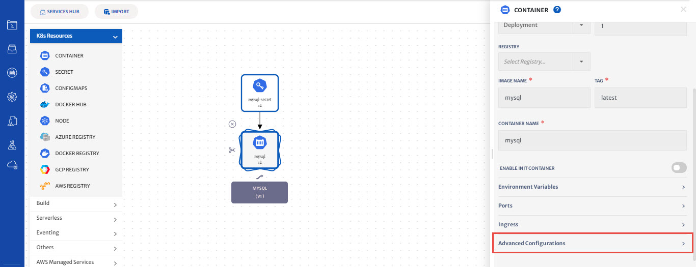
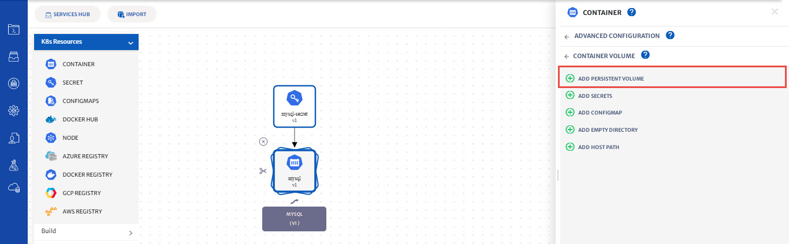
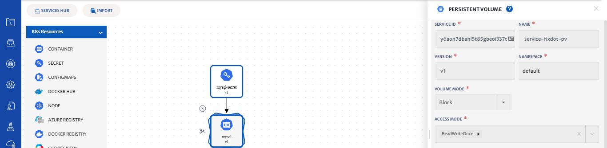
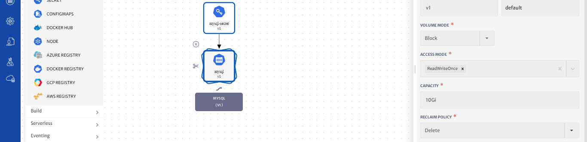
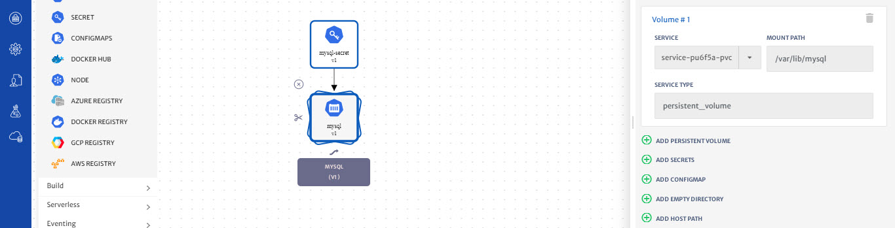
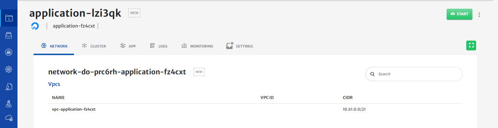
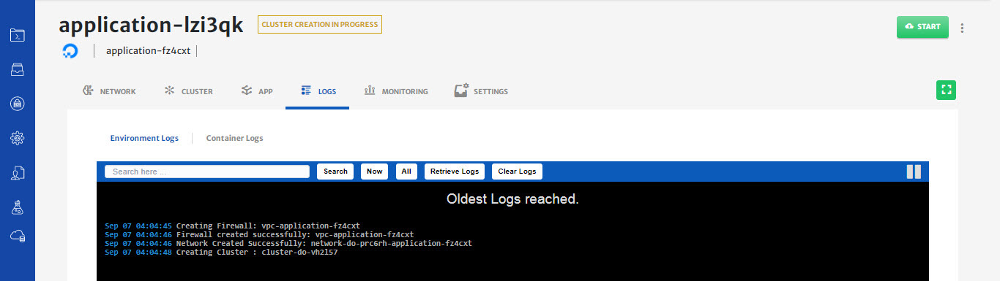
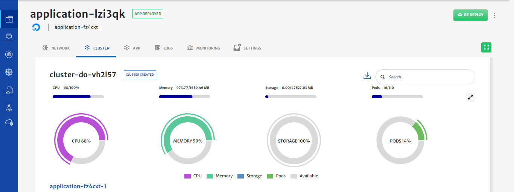
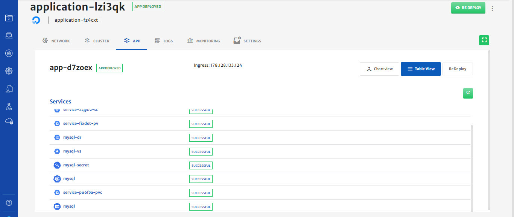

# Deploy MySQL with Persistent Storage 

Please refer to our [video guide for a walkthrough](https://www.youtube.com/watch?v=BcyNpwluRXY) on how to perform the below mentioned operations in platform. 

In this guide, we will show you how to create and deploy a MySQL application with persistent storage in 3 steps.

**Step 1: Create and Configure a Kubernetes cluster**

1. To configure a Kubernetes cluster, see our previous guide on [How to create and use a provider-managed Kubernetes cluster](https://docs.cloudplex.io/#/pages/user-guide/getting-started/create-use-provider-managed-cluster/create-use-provider-managed-cluster?id=create-amp-use-provider-managed-cluster).

**Step 2: Configure the Persistent volume with your MySQL container.**

1. In this guide, we’ll create a MySQL application and attach a persistent volume with it.

2. Before attaching volume with the MySQL container, we need to first create and configure a CloudPlex secret service and a mysql container.

3. To create and configure a Mysql container, see our guide **[How to deploy a MySQL server with a Kubernetes Secret](/pages/user-guide/getting-started/deploy-mysql-with-kubernetes-secret/deploy-mysql-with-kubernetes-secret?id=deploy-mysql-with-kubernetes-secret).**

4. Now that you have created a MySQL container and a CloudPlex secret service, let’s attach persistent volume.

5. There are many types of volumes, such as persistentVolume, hostPath, and emptyDir. 

6. CloudPlex provides support for all these volume types and an easy to use interface to use all of them.

7. Click on the MySQL container and click on advance configurations.

   

8. Select container volumes. For this guide, let's select persistent volume. Click on new to create a new Persistent Volume. CloudPlex will take you to the volume configurations panel. 

   

   

9. CloudPlex automatically populates default values for persistent volume (Service Id, Service Name, Namespace)

   

10. Enter a desired capacity of **10Gi** and select **delete** from the Reclaim policy dropdown.

    

11. Click on the save button to save the service.

12. Saving will take you back to container service configurations. Now, provide the volume mount path of /var/lib/mysql

    

13. Click on the save button to save the service.

14. All the Kubernetes manifests required to create a persistent volume (persistent volume claim, storageclass) are automatically created by the platform.

15. On saving the application, you will be taken to the status page

    

**Step 3: Deploy MySQL on the cluster**

1. Click on the Start button to start deploying the application on the cluster you have created

2. You will see logs as the application deployment progresses.

   

3. Click on the cluster tab to see the live status of your cluster.

4. “Cluster live status” is a complete dashboard that gives you the “live status” about the health and consumption of the nodes in your cluster.

   

5. You can see the status of the application you just deployed by clicking on the app tab and click on Table view to see the real time status of the MySQL service.

   

6. To avoid unnecessary costs, don’t forget to terminate your application when you are done.

7. Click on the terminate button to delete all your resources from Cloud.

   

**Conclusion:**

1. You just deployed MySQL server with a persistent volume using CloudPlex, the Kubernetes Application Platform for Developers. 