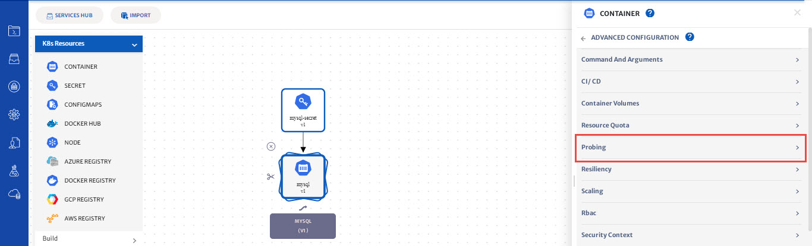
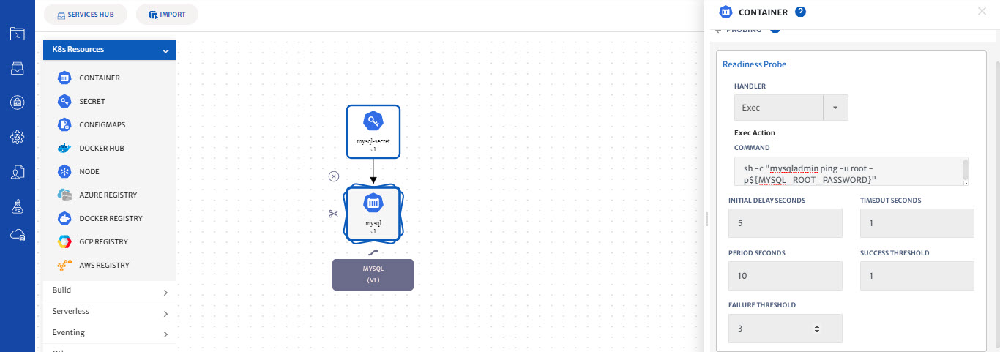
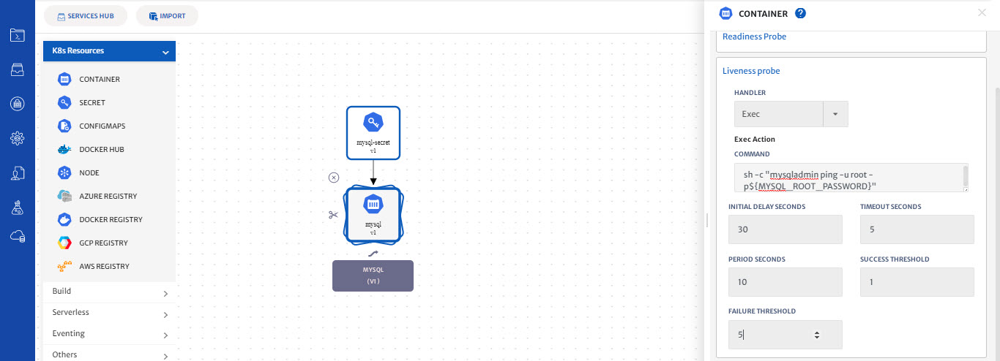
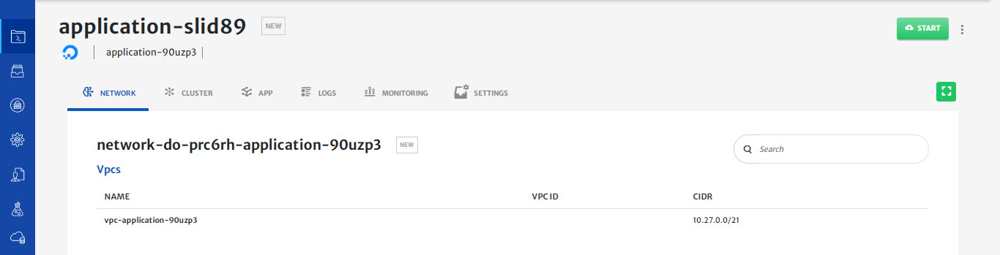
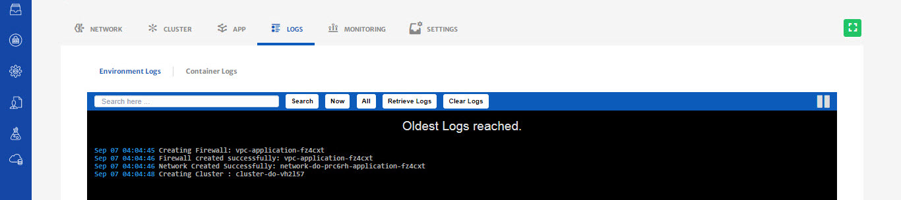

# Deploy MySQL with Readiness & Liveness Probe 

Please refer to our [video guide for a walkthrough](https://www.youtube.com/watch?v=dx6scY9lszo) on how to perform the below mentioned operations in platform. 

In this guide, we will show you how to create and deploy a MySQL with readiness and liveness probe in 3 steps.

**Step 1: Create and Configure a Kubernetes cluster**

1. To configure a Kubernetes cluster, see our previous guide on [How to create and use a provider-managed Kubernetes cluster](https://docs.cloudplex.io/#/pages/user-guide/getting-started/create-use-provider-managed-cluster/create-use-provider-managed-cluster?id=create-amp-use-provider-managed-cluster).

**Step 2: Configure probing with your MySQL container.**

1. In this guide, we’ll create a MySQL application and configure Probing with it

2. Before configuring probes for the MySQL container, we need to first create and configure a CloudPlex secret service and a mysql container.

3. To create and configure a Mysql container, see our guide **[How to deploy a MySQL server with a Kubernetes Secret](pages/user-guide/getting-started/deploy-mysql-with-kubernetes-secret/deploy-mysql-with-kubernetes-secret?id=deploy-mysql-with-kubernetes-secret).**

4. Now that you have created a MySQL container and a CloudPlex secret service, let’s configure probing

5. Kubernetes liveness and readiness probes can be used to make a service more robust and more resilient, by reducing operational issues and improving the quality of service.

6. Kubernetes uses readiness probes to decide when the container is available for accepting traffic. A pod is considered ready when all of its containers are ready. 

7. Kubernetes uses liveness probes to know when to restart a container. If a container is unresponsive—due to some issue, restarting the container can make the application more available.

8. To configure readiness and liveness probes, click on the MySQL container and click on advance configurations and then select probing.
   

9. Lets configure readiness probe first, Select **exec** from handler dropdown and pass the following command. 

   ***sh -c "mysqladmin ping -u root -p${MYSQL_ROOT_PASSWORD}"***

10. ***Type 5 in INITIAL DELAY SECONDS.***

11. ***Type 1 in TIMEOUT SECONDS***

12. ***Type 10 in PERIOD SECONDS***

13. ***Type 1 in SUCCESS THRESHOLD and 3 in FAILURE THRESHOLD***

14. All field descriptions are available on the platform once you hover on the field.
    

15. Lets configure the liveness probe next. Select **exec** from handler dropdown and pass the following command. 

    ***sh -c "mysqladmin ping -u root -p${MYSQL_ROOT_PASSWORD}"***

16. ***Type 30 in INITIAL DELAY SECONDS.***

17. ***Type 5 in TIMEOUT SECONDS***

18. ***Type 10 in PERIOD SECONDS***

19. ***Type 1 in SUCCESS THRESHOLD and 5 in FAILURE THRESHOLD***

    

20. Click on the save button to save your service

21. On saving the application, you will be taken to the status page
    

**Step 3: Deploy MySQL on the cluster**

1. Click on the Start button to start deploying the application on the cluster you have created
2. You will see logs as the application deployment progresses.
   
3. Click on the cluster tab to see the live status of your cluster.
4. “Cluster live status” is a complete dashboard that gives you the “live status” about the health and consumption of the nodes in your cluster 
   
5. You can see the status of the application you just deployed by clicking on the app tab and click on Table view to see the real time status of the MySQL service.
6. To avoid unnecessary costs, don’t forget to terminate your application when you are done.
7. Click on the terminate button to delete all your resources from Cloud.

**Conclusion:**

1. You just deployed MySQL server with liveness and readiness probe using CloudPlex, the Kubernetes Application Platform for Developers. 