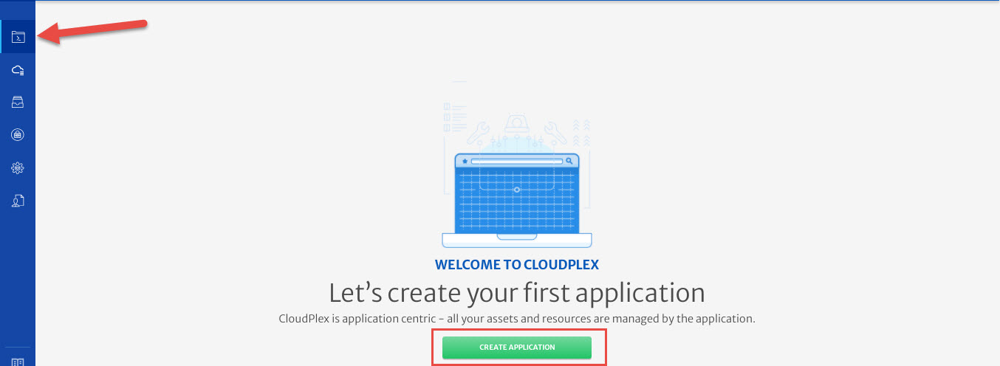
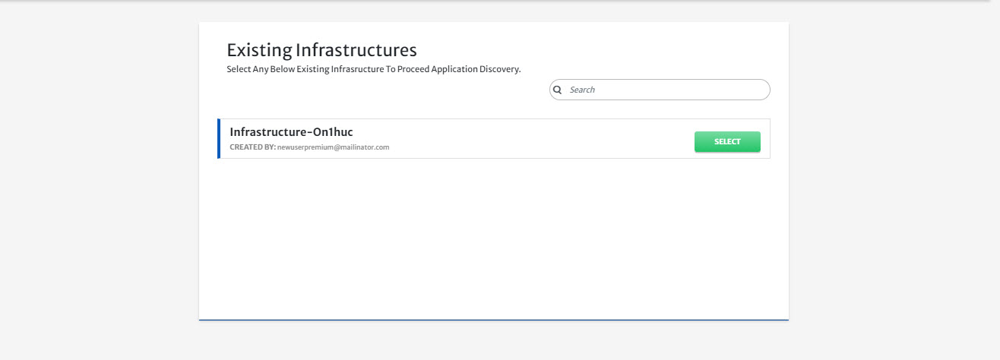
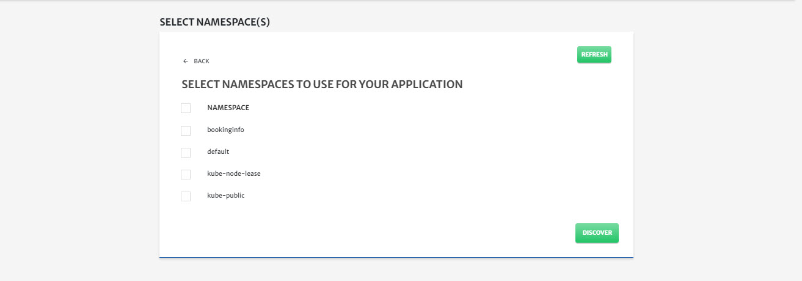
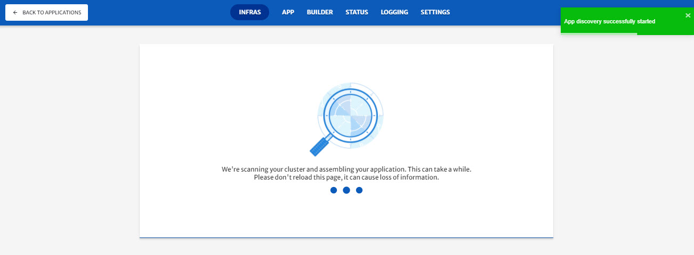
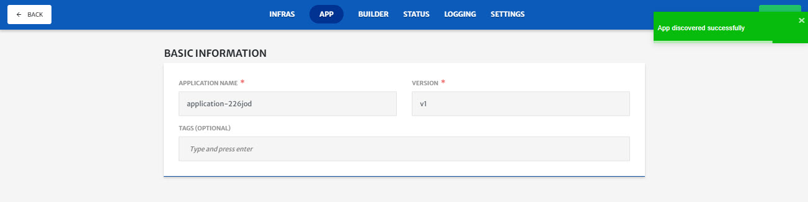
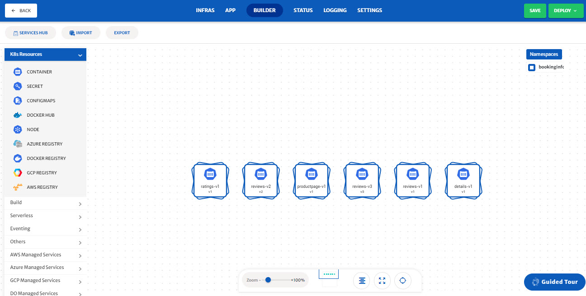
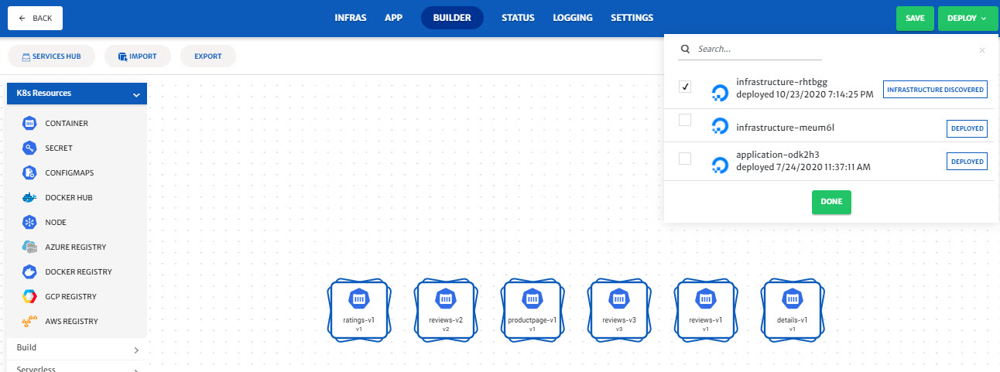
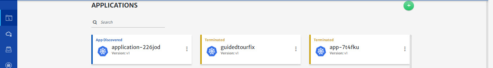
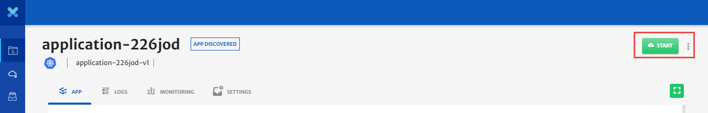

# Discover Existing Application

Discover existing application option can be used to discover existing applications from cloud and manage them using CloudPlex drag and drop view. This is not only helpful for users to manage their existing applications from CloudPlex but they can also migrate their applications to any other cloud. Using this feature, users can also add new services to their existing applications using CloudPlex intuitive interface.

Here is a step by step guide on how you can discover and manage applications using CloudPlex drag and drop view.

1. Click on the application icon from left pane and click **Create Application**.

   

2. **Select** discover existing application.

   

3. Select **Infrastructure** from the list from which you want to discover your existing application.

   > All the infrastructures will existings applications will appear in the list. Learn more about setting up an infrastructure [here](/pages/user-guide/getting-started/how-to-configure-infrastructure/how-to-configure-infrastructure?id=how-to-configure-infrastructure).

   

4. Select Namespace to use for the application and click **Discover**.

   

   

5. Once the application is discovered from cluster, enter **Application Name**, **Version** and click **Next**. You can also add **tags**.

   

6. Update your application from the **Builder** menu.
   Using application designer, you can build an application and save it for future use or deploy it right away on an infrastructure.

   > For detailed guide on how each service can be configured, please visit our Overview guide by clicking [here](pages/user-guide/components/components?id=components).

   

7. Click **Save** at top right to save your discovered application for future use or click **Deploy** to deploy your existing application.

   > Only infrastructures with status of **Infrastructure Discovered** or **Deployed** can be used for deployment. 

   

8. Select the required infrastructure from list and click **Done** to deploy. 
   If you **Saved** the application in previous step, you can go to the applications menu from left bar, select the required application and click **Start** to deploy the application. 

   

   