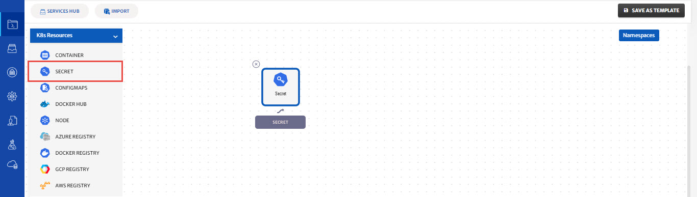
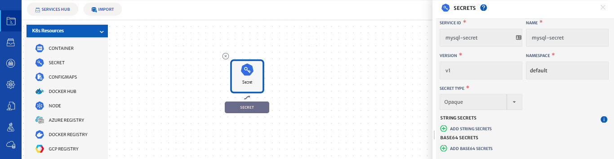
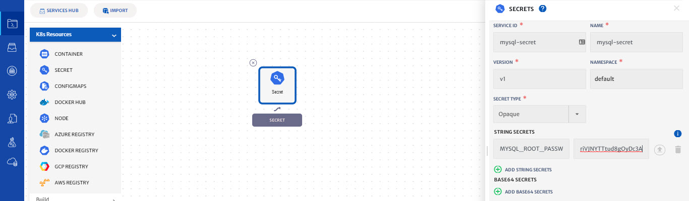
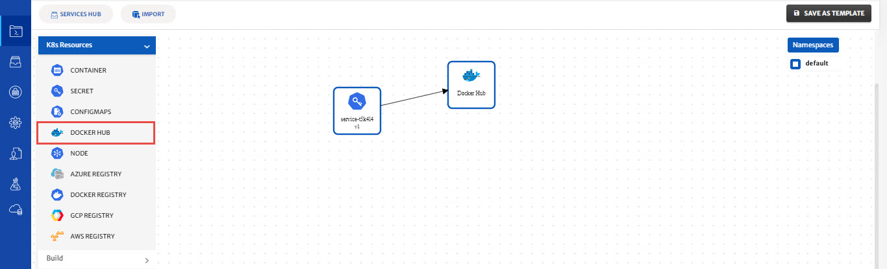
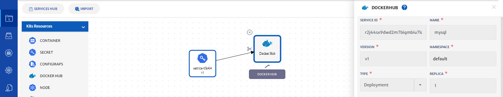
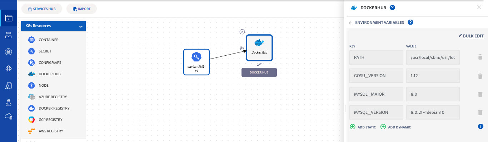
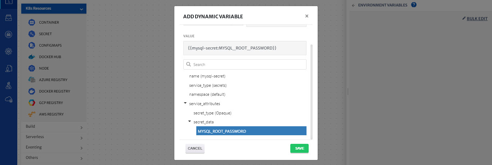
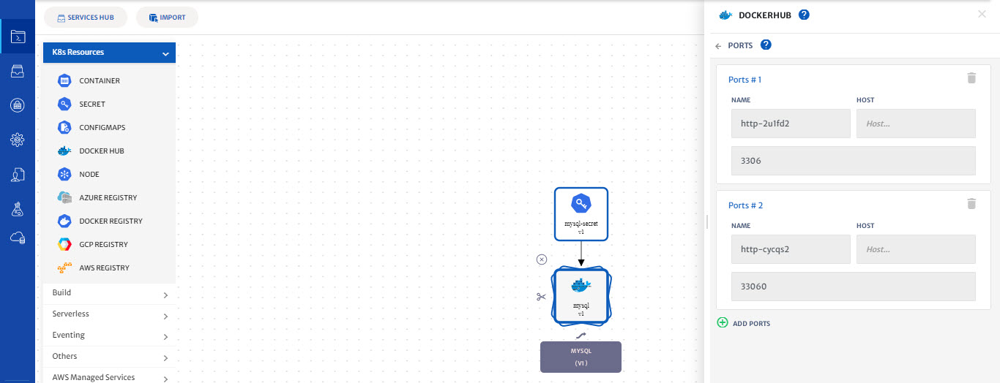
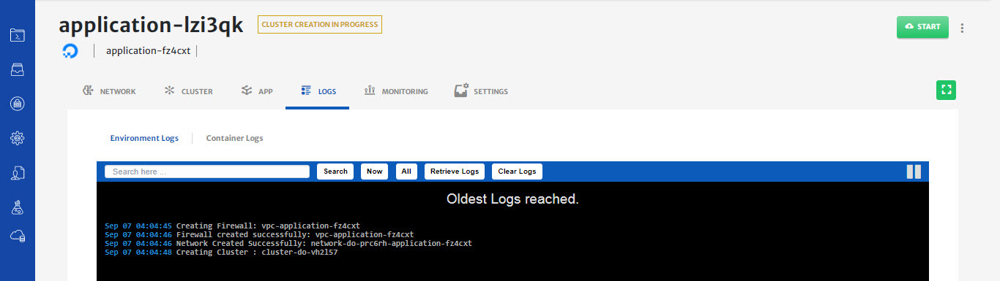
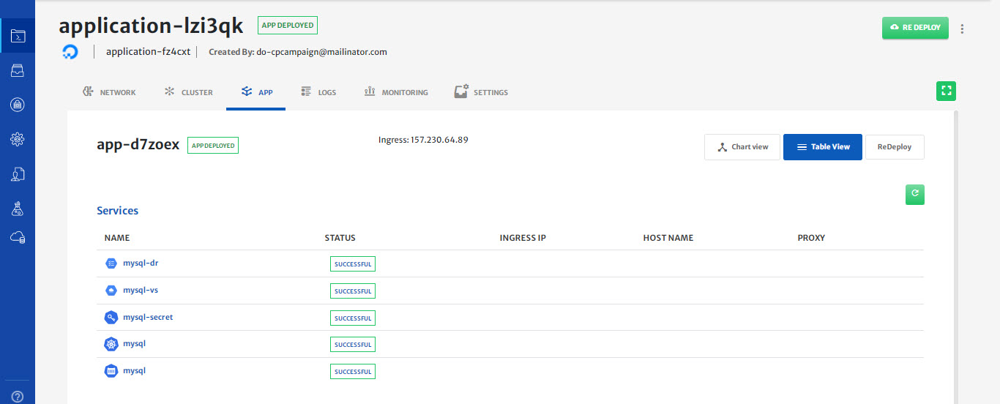

# Dynamic Parameters on MySql Deployment 

Please refer to our [video guide for a walkthrough](https://www.youtube.com/watch?v=MCx3PbTHbic) on how to perform the below mentioned operations in platform. 

In this guide, we will show you how to use Dynamic Parameters when deploying a MySQL server in 4 steps.

**Step 1: Create and Configure a Kubernetes cluster**

1. To configure a Kubernetes cluster, see our previous guide on [How to create and use a provider-managed Kubernetes cluster](https://docs.cloudplex.io/#/pages/user-guide/getting-started/create-use-provider-managed-cluster/create-use-provider-managed-cluster?id=create-amp-use-provider-managed-cluster).

**Step 2: Configure the MySQL Secret Service**

1. CloudPlex platform provides a secret management service that provides the ability to store sensitive data such as passwords, tokens, and certificates in Cloudplex. Any data entered in this service is stored in a secure vault with at-rest encryption. This eventually becomes a Kubernetes secret in a deployed application.

2. To configure the service, Drag-n-drop Secret service from pallet to the canvas.

   

3. Click on the service to open the configuration panel on the right side.

4. The platform will populate the default values of service (Service Id, Service Name, Namespace)

5. Update Service Id and Service Name to **mysql-secret**

   

6. By default, the type of secret is Opaque, you can choose different types according to your use case.

7. Click on Add secret string and type **MYSQL_ROOT_PASSWORD** in key and the Password in the value field. For this guide, type **5dzo2MsriVJNYTTtud8gOyDc3A** in the value field.

   

8. Click on save button to save service

**Step 3: Configure the MySQL Container**

1. Drag-n-drop the **Docker Hub** service from pallet to the canvas.

2. Drag the arrow from Secret service to container service.

   

3. Click on the service to open the configuration panel on the right side.

4. Type **MySQL** in the search bar and click on the **search** button.

5. Select MySQL service.

6. CloudPlex automatically pulls all the tags and metadata of the image and populates default values of service (Service Id, Service Name, Namespace, Type)

   

7. If you want to change the version of MySQL server, select from Tags dropdown and click on the fetch attributes button to fetch metadata of the image.

8. Click on environment variables and you will see two types, one is Static and other one is Dynamic. Static parameters are simple parameters in which you will provide your variables in key-value pair. For example, Port=80

9. Dynamic parameters are runtime parameters that are replaced at the time of deployment. This type of parameter is helpful to templatize your work for reuse. For example, imagine you are using your own managed MySQL DB in your application during development but in Production, you want to use Cloud Provider managed DB, in that case, you just have to replace DB service and then because parameters are dynamic, no changes are required.

   

10. Click on Dynamic Parameters, Click on the dropdown, you will see different services. All the linked services and your own service are available in the dropdown. Now, select **mysql-secret.**

11. Type **MYSQL_ROOT_PASSWORD** in the key field.

12. Expand Service Attributes and Secrets Data and select **MYSQL_ROOT_PASSWORD.** Cloudplex automatically generates dynamic parameters for you.

13. Click on the save button to save the parameters.

    

14. Click on the back button and click on the ports tab to configure ports.

15. Cloudplex automatically discovers ports from Docker images and populates them in the ports section of the service.

    

16. Click on the save button to save the service.

17. CloudPlex automatically generates the Kubernetes service manifest required for the service. If you want to modify any configuration, select the service and update it.

18. On saving the application, you will be taken to the status page

    

**Step 4: Deploy MySQL on the cluster**

1. Click on the Start button to start deploying the application on the cluster you have created

2. You will see logs as the application deployment progresses.

   

3. Click on the cluster tab to see the live status of your cluster.

4. “Cluster live status” is a complete dashboard that gives you the “live status” about the health and consumption of the nodes in your cluster.

   

5. You can see the status of the application you just deployed by clicking on the app tab and click on Table view to see the realtime status of the MySQL service.

   

6. To avoid unnecessary costs, don’t forget to terminate your application when you are done.

7. Click on the terminate button to delete all your resources from Cloud.

**Conclusion:**

1. You just deployed MySQL server with a Secret Service using CloudPlex, the Kubernetes Application Platform for Developers.