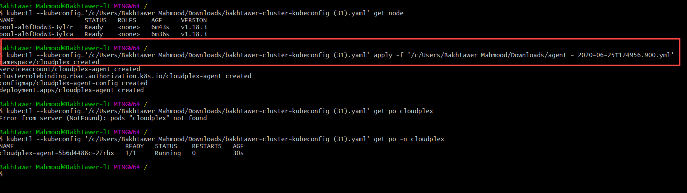
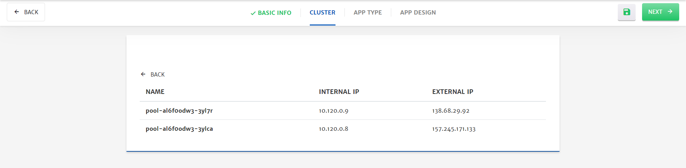
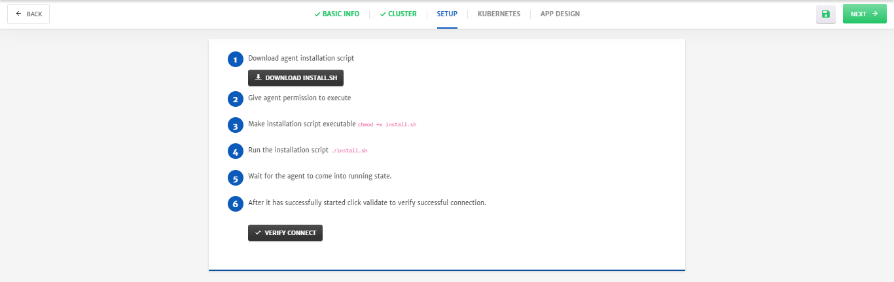

# Getting Started

Purpose of this getting started guide is take user through the end to end process of signing up and deployment. We are excited to have you try our platform. Once you are done with this guide, feel free to share your feedback at info@cloudplex.io. 

Now, lets move to the process of signing up and deployment

1. Go to [app.cloudplex.io/register](https://app.cloudplex.io/register) and sign up for a new account. 

   

2. After email verification, you will be able to login to platform.

   > First time user signing up using a company domain will have **Super User** access of platform.  For more details on how super user can invite team members, check our guide on Access Management by clicking [here](/pages/user-guide/components/access-management/access-management).

   

3. Once logged in, click **Create Application** button to start the application creation wizard. 


CloudPlex offers 3 ways of creating and deploying a new application on the cloud, based on the requirements and expertise level of the user. 

1. Provider Managed
   To setup a cloud provider (AWS, Azure etc) managed Kubernetes cluster on CloudPlex.
   - Create New Kubernetes Cluster
     To create new provider managed Kubernetes cluster from scratch
     
   - Use Existing Kubernetes Cluster

     This option can be used for the following 2 use cases

     1. To manage and deploy apps on any existing provider managed kubernetes cluster using CloudPlex
     2. To migrate application from any existing kubernetes cluster to CloudPlex. User can then add new services to the application or migrate that to any other cloud.
2. User Managed
   To build whole infrastructure and Kubernetes from scratch using CloudPlex intuitive user interface.
   - Create New Kubernetes Cluster
     To setup a new infrastructure and kubernetes cluster from scratch.
   - Create New On-Premise Kubernetes Cluster
     To use On-Premise machines to create a Kubernetes cluster.
3. Clone Existing Application
   Recommended for the users who want to use same configurations or configurations with minor changes of any existing project by cloning it. 


## Provider Managed - New Kubernetes Cluster

1. **Select** Create New Kubernetes Cluster from Provided Managed section.  

2. Configure the **General** tab. (Platform provides default values for most of the parameters)

   - Select the **Cloud Provider** and specify necessary account details for the account. (For this guide we have selected Azure Kubernetes Service)

   - Enter **Profile Name** and specify the Azure profile credentials (Client ID, Client Secret, Subscription ID, Tenant ID). You can also save this profile for future use. Credentials will be stored in vault i.e. Credentials Profile menu.

     > To know more about Credentials Profile menu, click [here](/pages/user-guide/components/credentials-profile/credentials-profile).
     >
     > To perform different functions and to deploy application using CloudPlex, it is necessary to have required permissions on cloud. To know about all those permissions click [here.](pages/user-guide/components/cloud-authorization-level/cloud-authorization-level?id=cloud-authorization-level)

   

3. Click **Next** at the top right of screen.

4. Configure Cluster.

   - Enter **Cluster Name**.

   - Select Machine Type from drop-down. (To know more about machine types click [here](https://azure.microsoft.com/en-us/pricing/details/virtual-machines/series/))

     > Minimum 4 CPU machine is needed for deployment. 

   - Specify **Node Count**.

   - (Optional) Enable **Custom Advance Settings** using radio button.

     > To configure advanced settings for Cluster, Node Pools and Network click here.

   

5. Click **Next** at the top right of screen.

6. Design application using **App Designer**.

   > As part of this guide, we will only configure the minimum settings necessary to deploy the container. For detailed configurations, please check our detailed guide by clicking [here](/pages/user-guide/components/container-services/container-services).

   - Drag and drop the **Container** in the package canvas from left column.

   - Click on **Container** icon to configure the settings. (Platform has provided default values for most of the parameters) 

     - Specify **Image Name** and **Tag**.
     - Go to **Environment Variables** menu and add Variable. It is necessary to add at least one variable which in our case is **MYSQL_ROOT_PASSWORD**.

     
     

     - Go to the **Ports**, click **Add Port** button and specify the port for Traffic i.e. **8080**

     

     - Click **Save.**

7. Click **Save** (green floppy icon at the top right) to save the application.

   

9. Click **Start** to deploy the application.

   

10. Once an application is started, platform automatically redirect to **Logs** tab. Logs help in monitoring of different phases of application deployment.


11. To check in-depth flow of traffic, go to the **Monitoring** tab.


## Provider Managed - Existing Kubernetes Cluster

1. **Select** Use Existing Kubernetes Cluster from Provided Managed section.  

2. Configure the **Basic Info** tab. (Platform provides default values for most of the parameters)

   - Select the **Cloud Provider**. (For this guide we have selected Azure Kubernetes Service)

   

3. Click **Next** at the top right of screen.

4. Configure **Cluster**.
   From here you can connect your existing kubernetes cluster with CloudPlex.  

   - Download YML file. 

   - Configure kubectl (client) with your existing kubernetes cluster that you want to import. 

   - Run following command on downloaded YML file. 

     ```
     kubectl apply -f agent.yml
     ```

   > Download Config file of the cluster from the cloud and apply agent on that as shown in the picture below.
   
   
   
   - Once pod is in running state, click **Verify Connect** to verify the connection with cluster. 
   
   
   
5.  Click **Next** at the top right of screen.

6. Select **App Type**.
   **Select New Application**: To deploy new CloudPlex managed application on existing kubernetes cluster. (creating new application as part of this guide)
   **Select Existing Application:** To migrate application from any kubernetes cluster to CloudPlex. 

   

7. Click **Next** at the top right of screen.

8. Design application using **App Designer**.

   > As part of this guide, we will only configure the minimum settings necessary to deploy the container. For detailed configurations, please check our detailed guide by clicking [here](/pages/user-guide/components/container-services/container-services).

   - Drag and drop the **Container** in the package canvas from left column.

   - Click on **Container** icon to configure the settings. (Platform has provided default values for most of the parameters) 

     - Specify **Image Name** and **Tag**.
     - Go to **Environment Variables** menu and add Variable. It is necessary to add at least one variable which in our case is **MYSQL_ROOT_PASSWORD**.

     
     

     - Go to the **Ports**, click **Add Port** button and specify the port for Traffic i.e. **8080**

     

     - Click **Save.**

9. Click **Save** (green floppy icon at the top right) to save the application.

   

10. Click **Start** to deploy the application.

    

11. Once an application is started, platform automatically redirect to **Logs** tab. Logs help in monitoring of different phases of application deployment.


11. To check in-depth flow of traffic, go to the **Monitoring** tab.


## User Managed - New Kubernetes Cluster

1. **Select** Create New Kubernetes Cluster from User Managed section.  

2. Configure the **Basic Info** tab. (Platform has provided default values for most of the parameters)

   - Select the **Cloud Provider** and specify necessary account details for the account. (For this guide we have selected Azure)

   - Enter **Profile Name** and specify the Azure profile credentials (Client ID, Client Secret, Subscription ID, Tenant ID). You can also save this profile for future use. Credentials will be stored in vault i.e. Credentials Profile menu.

     > To know more about Credentials Profile menu, click [here](/pages/user-guide/components/credentials-profile/credentials-profile).
     >
     > To perform different functions and to deploy application using CloudPlex, it is necessary to have required permissions on cloud. To know about all those permissions click [here.](pages/user-guide/components/cloud-authorization-level/cloud-authorization-level?id=cloud-authorization-level)

   

3. Click **Next** at the top right of screen.

4. Customize Network configurations as per requirements.

   > **Note:** Most of the fields are prepopulated with default values but you can also customize the configurations as per your requirements. 

   - Specify VPC **CIDR**.
   - Specify Subnet **CIDR**. (You can also add multiple subnets by clicking the **+** icon)

   

   - (Optional) Go to **Security Groups** tab, to add Inbound or Outbound traffic rules. 
     Platform provides preconfigured traffic rules, but you can customize them as per the requirements.

   

5. Click **Next** at the top right of screen.

6. Configure **Cluster**.

   - Most of the fields are preconfigured, but you can also customize them.
   - Select **Credential Type** from dropdown, i.e. **Key** in this case, select **Key Type** i.e. **New**, **Enter Key Name** and click **Generate**. A side menu will open, click **Save** and new SSH key will be generated. 

7. Click **Next** at the top right of screen.

8. (Optional) Configure **Kubernetes**.

   - Select **Kubernetes, Istio, Knative Version** from drop-down to install on cluster.

   - Specify **Pod Address Range** that will be assigned to the pods in cluster.

   - Use Radio buttons to enable **Load Balancing** and **Network Policy**.

      > Before deploying application, system will first install kubernetes on cluster.

   

9. Click **Next** at the top right of screen.

10. Design application using **App Designer**.

    > As part of this guide, we will only configure the minimum settings necessary to deploy the container. For detailed configurations, please check our detailed guide by clicking [here](/pages/user-guide/components/container-services/container-services).

    - Drag and drop the **Container** in the package canvas from left column.

    - Click on **Container** icon to configure the settings. (Platform has provided default values for most of the parameters) 

      - Specify **Image Name** and **Tag**.
      - Go to **Environment Variables** menu and add Variable. It is necessary to add at least one variable which in our case is **MYSQL_ROOT_PASSWORD**.

      
      

      - Go to the **Ports**, click **Add Port** button and specify the port for Traffic i.e. **8080**

      

      - Click **Save.**

11. Click **Save** (green floppy icon at the top right) to save the application.

    

12. Click **Start** to deploy the application.

    

13. Once an application is started, platform automatically redirect to **Logs** tab. Logs help in monitoring of different phases of application deployment.


11. To check in-depth flow of traffic, go to the **Monitoring** tab.


## User Managed - New On-Premise Kubernetes Cluster

1. **Select** Create New On-Premise Kubernetes Cluster from User Managed section.  

2. Configure the **Basic Info** tab. (Platform has provided default values for most of the parameters)

   

3. Click **Next** at the top right of screen.

4. Configure **Cluster**.

   - Specify **Username**, **Public IP** and **SSH Key** for the on-prem cluster.

     > You can also use existing Cloud instances, e.g. AWS EC2, Azure VM etc, to setup on-prem cluster.

   

5. Click **Next** at the top right of screen.

6. **Setup** cluster.

   From here you can connect your on-prem cluster with CloudPlex.  (Follow on screen instructions to install agent on your machine)

   

   - Once agent is in running state, click **Verify Connect** to verify the connection with cluster.

7. Click **Next** at the top right of screen.

8. (Optional) Configure **Kubernetes**.

   - Select **Kubernetes, Istio, Knative Version** from drop-down to install on cluster.

   - Specify **Pod Address Range** that will be assigned to the pods in cluster.

   - Use Radio buttons to enable **Load Balancing** and **Network Policy**.

     > Before deploying application, system will first install kubernetes on cluster.

   

9. Click **Next** at the top right of screen.

10. Design application using **App Designer**.

    > As part of this guide, we will only configure the minimum settings necessary to deploy the container. For detailed configurations, please check our detailed guide by clicking [here](/pages/user-guide/components/container-services/container-services).

    - Drag and drop the **Container** in the package canvas from left column.

    - Click on **Container** icon to configure the settings. (Platform has provided default values for most of the parameters) 

      - Specify **Image Name** and **Tag**.
      - Go to **Environment Variables** menu and add Variable. It is necessary to add at least one variable which in our case is **MYSQL_ROOT_PASSWORD**.

      
      

      - Go to the **Ports**, click **Add Port** button and specify the port for Traffic i.e. **8080**

      

      - Click **Save.**

11. Click **Save** (green floppy icon at the top right) to save the application.

    

12. Click **Start** to deploy the application.

    

13. Once an application is started, platform automatically redirect to **Logs** tab. Logs help in monitoring of different phases of application deployment.


11. To check in-depth flow of traffic, go to the **Monitoring** tab.

