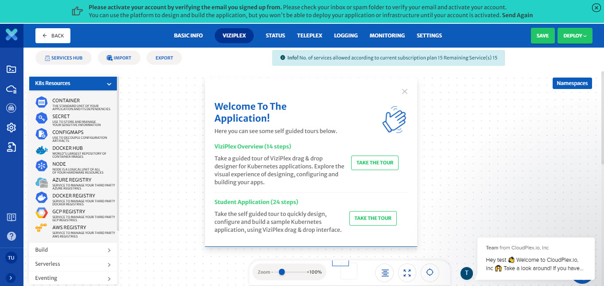

# Getting Started

Purpose of this getting started guide is take user through the end to end process of signing up and deployment. We are excited to have you try our platform. Once you are done with this guide, feel free to share your feedback at info@cloudplex.io. 

Now, lets move to the process of signing up and deployment

1. Go to [app.cloudplex.io/register](https://app.cloudplex.io/register) and sign up for a new account. 

   

2. As soon as you sign up you will be redirected to our CloudPlex platform. 
   CloudPlex provides self guided tours to get users up to speed in no time. Our self guides tour is a great way to learn more about the platform and how to use it. User can also use our live chat feature from the right bottom of the screen to get in touch with our team. 

   > you won't be able to deploy your application or infrastructure until your account is activated.

   

3. Activate your account by verifying your email. 

   

4. After email verification, you will be able to create and deploy your cloud native applications using CloudPlex. 

   > First time user signing up using a company domain will have **Super User** access of platform.  For more details on how super user can invite team members, check our guide on Access Management by clicking [here](/pages/user-guide/components/access-management/access-management).

5. Once inside CloudPlex, you can start building your application using [ViziPlex](/pages/user-guide/components/viziplex/viziplex?id=viziplex). 

Two types of applications can be created on CloudPlex.

1. **Create New Application**
   To design and deploy new application from scratch using CloudPlex interactive drag-n-drop interface.
2. **Discover Existing Application**
   To discover your existing cloud application and manage it with CloudPlex Visual Drag-n-Drop Interface.

> Infrastructure will need to be configured first on CloudPlex to discover existing applications from cloud. 

For a step by step guide on how to configure and manage different type of applications on kubernetes cluster using CloudPlex, navigate to the respective guide below.

> To deploy on application on cloud, it is necessary for the user cloud profile to have all the required permissions. For detailed guide on all the required permissions, click [here](/pages/user-guide/components/cloud-authorization-level/cloud-authorization-level).

1. [Build Application with CloudPlex](pages/user-guide/tutorials/build-application-with-cloudplex/build-application-with-cloudplex?id=build-application-with-cloudplex)
2. [Deploy Infrastructure using KubePlex](/pages/user-guide/tutorials/deploy-infrastructure-using-kubeplex/deploy-infrastructure-using-kubeplex?id=deploy-infrastructure-using-kubeplex)