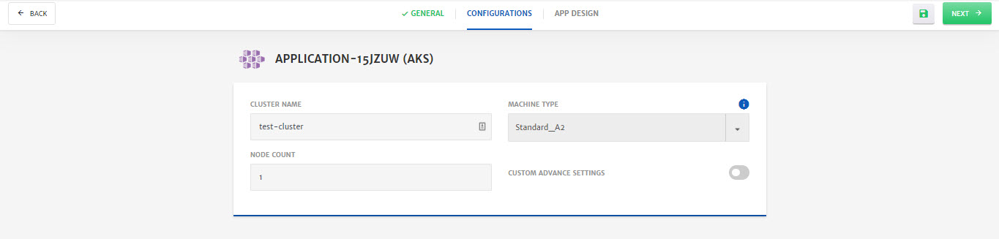
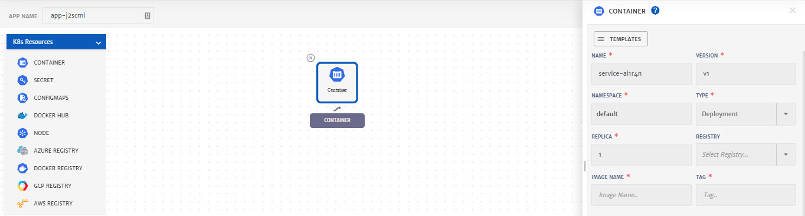
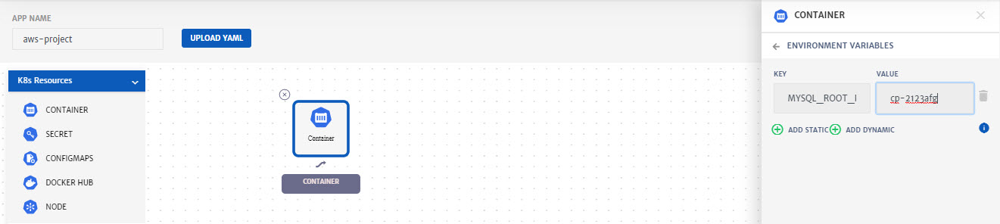
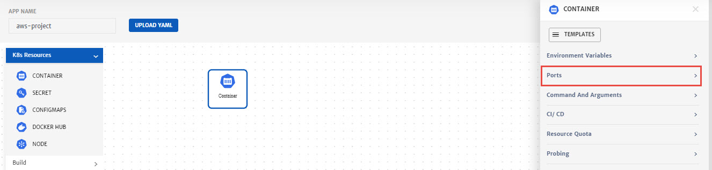
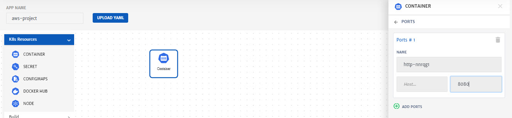
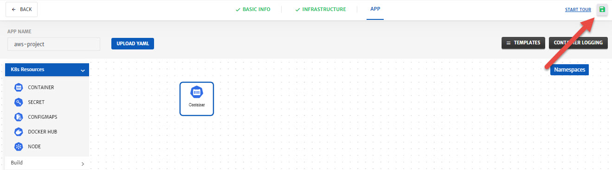

# Getting Started

Welcome to CloudPlex! 

Purpose of this getting started guide is take user through the end to end process of signing up and deployment. We are excited to have you try our platform. Once you are done with this guide, feel free to share your feedback at info@cloudplex.io. For detailed guide on what CloudPlex has to offer click [here](/overview).

Now, lets move to the process of signing up and deployment

1. Go to [app.cloudplex.io/register](https://app.cloudplex.io/register) and sign up for a new account. 

   

2. After email verification, you will be able to login to platform.

   > **Note:** First time user signing up using a company domain will have **Super User** access of platform.  For more details on how super user can invite team members, check our guide on Access Management by clicking [here](/pages/user-guide/components/access-management/access-management).

   

3. Once logged in, click **Create Project** button to start the project creation wizard. 

CloudPlex offers 3 way of creating and deploying a new application on cloud based on the requirements and expertise level of the user. 

1. Provider Managed
   To setup a cloud provider (AWS, Azure etc) managed Kubernetes cluster on CloudPlex.
   - Create New Kubernetes Cluster
     To create new provider managed Kubernetes cluster from scratch
   - Use Existing Kubernetes Cluster
     To use any existing provider managed Kubernetes cluster
2. User Managed
   To build whole infrastructure and Kubernetes from scratch using CloudPlex intuitive user interface.
   - Create New Kubernetes Cluster
     To setup a new infrastructure and cluster from scratch.
   - Create New On-Premise Kubernetes Cluster
     To use On-Premise machines to create a Kubernetes cluster.
3. Clone Existing Application
   Recommended for the users who want to use same configurations or configurations with minor changes of any existing project by cloning it. 

## Provider Managed - Create New Kubernetes Cluster

1. **Select** Create New Kubernetes Cluster from Provided Managed section.  

2. Configure the **General** tab. (Platform provides default values for most of the parameters)

   - Select the **Cloud Provider** and specify necessary account details for the account. (For this guide we have selected Azure Kubernetes Service)

   - Enter **Profile Name** and specify the Azure profile credentials (Client ID, Client Secret, Subscription ID, Tenant ID). You can also save this profile for future use. Credentials will be stored in vault i.e. Credentials Profile menu.

     > **Note**: To know more about Credentials Profile menu, click [here](/pages/user-guide/components/credentials-profile/credentials-profile).
     >
     > **Note:** To perform different functions and to deploy application using CloudPlex, it is necessary to have required permissions on cloud. To know about all those permissions click [here.](pages/user-guide/components/cloud-authorization-level/cloud-authorization-level?id=cloud-authorization-level)

   

3. Click **Next** at the top right of screen.

4. Configure Cluster.

   - Enter **Cluster Name**.

   - Select Machine Type from drop-down. (To know more about machine types click [here](https://azure.microsoft.com/en-us/pricing/details/virtual-machines/series/))

     > Minimum 4 CPU machine is needed for deployment. 

   - Specify **Node Count**.

   - Enable **Custom Advance Settings** using radio button.

   

5. Click **Next** at the top right of screen.

6. Design application using **App Designer**.

   > **Note**: As part of this guide, we will only configure the minimum settings necessary to deploy the container. For detailed configurations, please check our detailed guide by clicking [here](/pages/user-guide/components/container-services/container-services).

   - Drag and drop the **Container** in the package canvas from left column.

   - Click on **Container** icon to configure the settings. (Platform has provided default values for most of the parameters) 

     - Specify **Image Name** and **Tag**.
     - Go to **Environment Variables** menu and add Variable. It is necessary to add at least one variable which in our case is **MYSQL_ROOT_PASSWORD**.

     
     

     - Go to the **Ports**, click **Add Port** button and specify the port for Traffic i.e. **8080**

     

     - Click **Save.**

7. Click **Save** (green floppy icon at the top right) to save the project.

   

8. Click the Project, you just created. 

   

9. Click **Start** to deploy the project

   

10. Once a project is deployed, go to the **Logs** tab to check the logs. 

11. To check in-depth flow of traffic, go to the **Monitoring** tab.

## Quick Start

1. **Select** Quick Start from options. 

2. Configure the **Basic Info** tab. (Platform has provided default values for most of the parameters)

   - Select the **Cloud Provider** and specify necessary account details for the account. (For this guide we have selected AWS)

   - Enter **Profile Name** and specify the AWS credentials (Access and Secret Key). You can also save this profile for future use. Credentials will be stored in vault i.e. Credentials Profile menu.

     > **Note**: To know more about Credentials Profile menu, click [here](/pages/user-guide/components/credentials-profile/credentials-profile).
     >
     > **Note:** To perform different functions and to deploy application using CloudPlex, it is necessary to have required permissions on cloud. To know about all those permissions click [here.](pages/user-guide/components/cloud-authorization-level/cloud-authorization-level?id=cloud-authorization-level)

   

3. Click **Next** at the top right of screen.

4. As part of Quick Start project creation, CloudPlex provides preconfigured **Infrastructure** (Cluster and Network). 

   - Click **Download Key** to download SSH key as you might need it in future. 

   

5. Click **Next** at the top right of screen.

6. Configure **APP**.

   > **Note**: As part of this guide, we will only configure the minimum settings necessary to deploy the container. For detailed configurations, please check our detailed guide by clicking [here](/pages/user-guide/components/container-services/container-services).

   - Drag and drop the **Container** in the package canvas from left column.

   - Click on **Container** icon to configure the settings. (Platform has provided default values for most of the parameters) 

     - Scroll down and specify **Image Name** and **Tag**.

     - Go to **Environment Variables** menu and add Variable. It is necessary to add at least one variable which in our case is **MYSQL_ROOT_PASSWORD**.

     
     

     - Go to the **Ports**, click **Add Port** button and specify the port for Traffic i.e. **8080**

     
     

     - Click **Save.**

7. Click **Save** (green floppy icon at the top right) to save the project.

   

8. Click the Project, you just created. 

   

9. Click **Start** to deploy the project

   

10. Once a project is deployed, go to the **Logs** tab to check the logs. 

   

11. To check in-depth flow of traffic, go to the **Monitoring** tab.

    

## Use Template

1. **Select** Use Template from options. 

2. Configure the **Basic Info** tab. (Platform has provided default values for most of the parameters)

   - Select the **Cloud Provider** and specify necessary account details for the account. (For this guide we have selected AWS)

   - Enter **Profile Name** and specify the AWS credentials (Access and Secret Key). You can also save this profile for future use. Credentials will be stored in vault i.e. Credentials Profile menu.

     > **Note**: To know more about Credentials Profile menu, click [here](/pages/user-guide/components/credentials-profile/credentials-profile).
     >
     > **Note:** To perform different functions and to deploy application using CloudPlex, it is necessary to have required permissions on cloud. To know about all those permissions click [here.](pages/user-guide/components/cloud-authorization-level/cloud-authorization-level?id=cloud-authorization-level)

   

3. Click **Next** at the top right of screen.

4. As part of Use Template project creation, CloudPlex provides preconfigured **Infrastructure** (Cluster and Network) templates. You can select any one from the **CloudPlex Templates** tab. These templates are also customizable.  

5. Click **Next** at the top right of screen.

6. Customize Network configurations as per requirements or click **Next**.

   

7. Configure **Cluster**.

   - Most of the fields are preconfigured, but you can also customize them.
   - Select **Key Type** from dropdown, i.e. **New** in this case, **Enter Key Name** and click **Generate**. A side menu will open, click **Save** and new SSH key will be generated. 

   

8. Click **Next** at the top right of screen.

9. Configure **APP**.

   > **Note**: As part of this guide, we will only configure the minimum settings necessary to deploy the container. For detailed configurations, please check our detailed guide by clicking [here](/pages/user-guide/components/container-services/container-services).

   - Drag and drop the **Container** in the package canvas from left column.

   - Click on **Container** icon to configure the settings. (Platform has provided default values for most of the parameters) 

     - Scroll down and specify **Image Name** and **Tag**.
     - Go to **Environment Variables** menu and add Variable. It is necessary to add at least one variable which in our case is **MYSQL_ROOT_PASSWORD**.

     
     

     - Go to the **Ports**, click **Add Port** button and specify the port for Traffic i.e. **8080**

     
     

     - Click **Save.**

10. Click **Save** (green floppy icon at the top right) to save the project.

11. Click the Project, you just created. 

    

12. Click **Start** to deploy the project

    

13. Once a project is deployed, go to the **Logs** tab to check the logs. 

    

14. To check in-depth flow of traffic, go to the **Monitoring** tab.

    

## Advanced

1. **Select** Advanced from options. 

2. Configure the **Basic Info** tab. (Platform has provided default values for most of the parameters)

   - Select the **Cloud Provider** and specify necessary account details for the account. (For this guide we have selected AWS)

   - Enter **Profile Name** and specify the AWS credentials (Access and Secret Key). You can also save this profile for future use. Credentials will be stored in vault i.e. Credentials Profile menu.

     > **Note**: To know more about Credentials Profile menu, click [here](/pages/user-guide/components/credentials-profile/credentials-profile).
     >
     > **Note:** To perform different functions and to deploy application using CloudPlex, it is necessary to have required permissions on cloud. To know about all those permissions click [here.](pages/user-guide/components/cloud-authorization-level/cloud-authorization-level?id=cloud-authorization-level)

   

3. Click **Next** at the top right of screen.

4. Customize Network configurations as per requirements.

   > **Note:** Most of the fields are prepopulated with default values but you can also customize the configurations as per your requirements. 

   - Specify VPC **CIDR**.
   - Specify Subnet **CIDR**. (You can also add multiple subnets by clicking the **+** icon)

   

   - (Optional) Go to **Security Group** tab, to add Inbound or Outbound traffic rules. 

   

5. Click **Next** at the top right of screen.

6. Configure **Cluster**.

   - Most of the fields are preconfigured, but you can also customize them.
   - Select **Key Type** from dropdown, i.e. **New** in this case, **Enter Key Name** and click **Generate**. A side menu will open, click **Save** and new SSH key will be generated. 

   

7. Click **Next** at the top right of screen.

8. Configure **APP**.

   > **Note**: As part of this guide, we will only configure the minimum settings necessary to deploy the container. For detailed configurations, please check our detailed guide by clicking [here](/pages/user-guide/components/container-services/container-services).

   - Drag and drop the **Container** in the package canvas from left column.

   - Click on **Container** icon to configure the settings. (Platform has provided default values for most of the parameters) 

     - Scroll down and specify **Image Name** and **Tag**.
     - Go to **Environment Variables** menu and add Variable. It is necessary to add at least one variable which in our case is **MYSQL_ROOT_PASSWORD**.

     
     

     - Go to the **Ports**, click **Add Port** button and specify the port for Traffic i.e. **8080**

     
     

     - Click **Save.**

9. Click **Save** (green floppy icon at the top right) to save the project.

11. Click the Project, you just created. 

    

12. Click **Start** to deploy the project

    

13. Once a project is deployed, go to the **Logs** tab to check the logs. 

    

14. To check in-depth flow of traffic, go to the **Monitoring** tab.

    