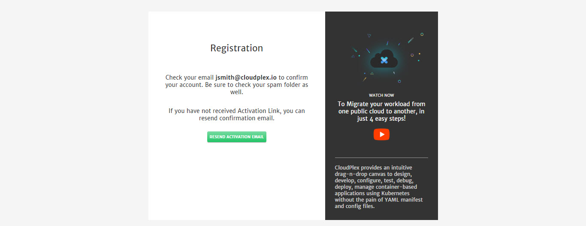

# Getting Started

Purpose of this getting started guide is take user through the end to end process of signing up and deployment. We are excited to have you try our platform. Once you are done with this guide, feel free to share your feedback at info@cloudplex.io. 

Now, lets move to the process of signing up and deployment

1. Go to [app.cloudplex.io/register](https://app.cloudplex.io/register) and sign up for a new account. 

   

2. (**In case you haven't received verification email**) Click **Resend Activation Email** to resend the email.

   

3. After email verification, you will be able to login to platform.

   > First time user signing up using a company domain will have **Super User** access of platform.  For more details on how super user can invite team members, check our guide on Access Management by clicking [here](/pages/user-guide/components/access-management/access-management).

   

4. Once logged in, click **Create Application** button to start the application creation wizard. 

Two types of applications can be created on CloudPlex.

1. **Create New Application**
   To design and deploy new application from scratch using CloudPlex interactive drag-n-drop interface.
2. **Discover Existing Application**
   To discover your existing cloud application and manage it with CloudPlex Visual Drag-n-Drop Interface.

> Infrastructure will need to be configured first on CloudPlex to discover existing applications from cloud. 

For a step by step guide on how to configure and manage different type of applications on kubernetes cluster using CloudPlex, navigate to the respective guide below.

> To deploy on application on cloud, it is necessary for the user cloud profile to have all the required permissions. For detailed guide on all the required permissions, click [here](/pages/user-guide/components/cloud-authorization-level/cloud-authorization-level).

1. [Create New Application](pages/user-guide/getting-started/create-new-application/create-new-application?id=create-new-application)
2. [Discover Existing Application](pages/user-guide/getting-started/discover-existing-application/discover-existing-application?id=discover-existing-application)
3. [How to Configure Infrastructure](pages/user-guide/getting-started/how-to-configure-infrastructure/how-to-configure-infrastructure?id=how-to-configure-infrastructure)