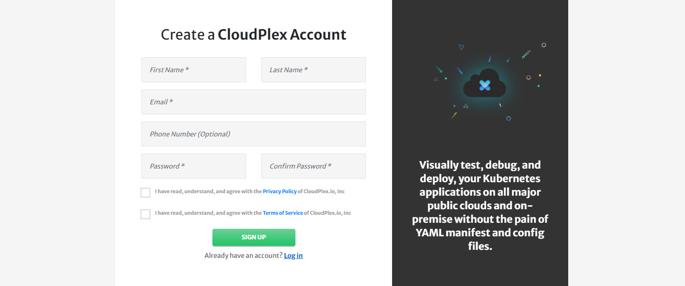

# Getting Started

Purpose of this getting started guide is take user through the end to end process of signing up and deployment. We are excited to have you try our platform. Once you are done with this guide, feel free to share your feedback at info@cloudplex.io. 

Now, lets move to the process of signing up and deployment

1. Go to [app.cloudplex.io/register](https://app.cloudplex.io/register) and sign up for a new account. 

   

2. After email verification, you will be able to login to platform.

   > First time user signing up using a company domain will have **Super User** access of platform.  For more details on how super user can invite team members, check our guide on Access Management by clicking [here](/pages/user-guide/components/access-management/access-management).

   

3. Once logged in, click **Create Application** button to start the application creation wizard. 

CloudPlex offers 3 ways of creating and deploying a new application on the cloud, based on the requirements and expertise level of the user. 

1. Provider Managed
   To setup a cloud provider (AWS, Azure etc) managed Kubernetes cluster on CloudPlex.
   - Create New Kubernetes Cluster
     To create new provider managed Kubernetes cluster from scratch
     
   - Use Existing Kubernetes Cluster

     This option can be used for the following 2 use cases

     1. To manage and deploy apps on any existing provider managed kubernetes cluster using CloudPlex
     2. To migrate application from any existing kubernetes cluster to CloudPlex. User can then add new services to the application or migrate that to any other cloud.
2. User Managed
   To build whole infrastructure and Kubernetes from scratch using CloudPlex intuitive user interface.
   - Create New Kubernetes Cluster
     To setup a new infrastructure and kubernetes cluster from scratch.
   - Create New On-Premise Kubernetes Cluster
     To use On-Premise machines to create a Kubernetes cluster.
3. Clone Existing Application
   Recommended for the users who want to use same configurations or configurations with minor changes of any existing project by cloning it. 

For a step by step guide on how to configure and manage different type of kubernetes cluster using CloudPlex, navigate to the respective guide below.

1. [Provider Managed - New Kubernetes Cluster](pages/user-guide/getting-started/pm-new-cluster/pm-new-cluster)
2. [Provider Managed - Existing Kubernetes Cluster](pages/user-guide/getting-started/pm-existing-cluster/pm-existing-cluster)
3. [User Managed - New Kubernetes Cluster](pages/user-guide/getting-started/um-new-cluster/um-new-cluster)
4. [User Managed - New On-Premise Kubernetes Cluster](pages/user-guide/getting-started/um-new-op-cluster/um-new-op-cluster)