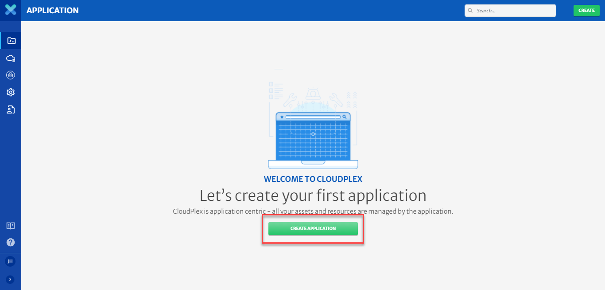
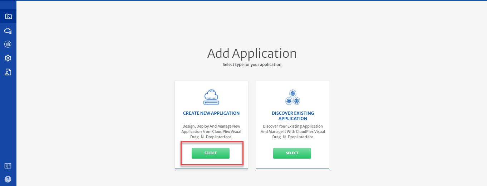
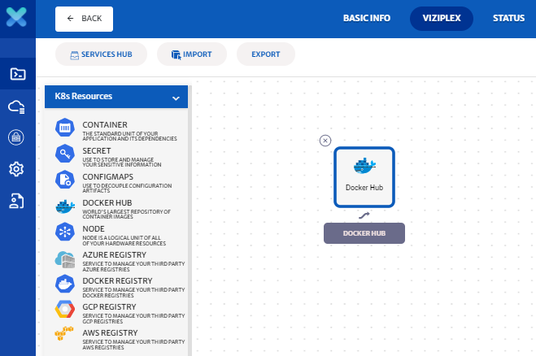
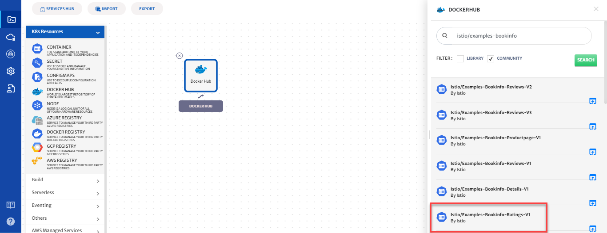
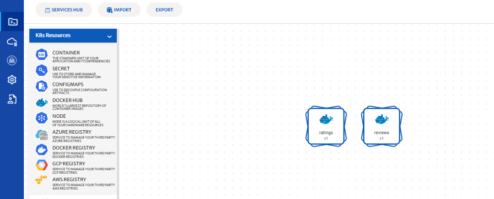
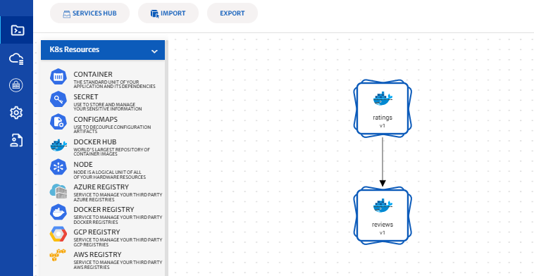
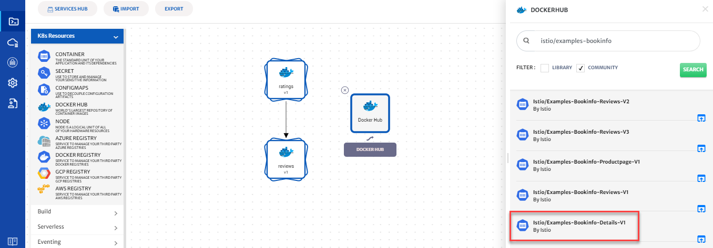
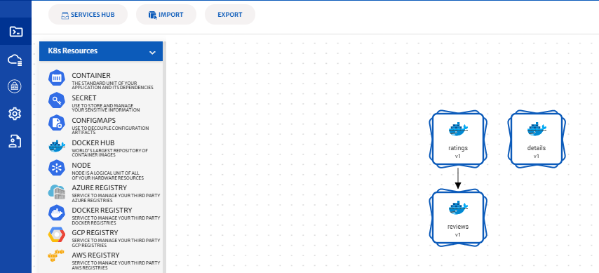

# How to Build Application with CloudPlex 

The purpose of this guide is to take user through the process of creation and configuration of a Kubernetes application from scratch, without writing a YAML manifest or HELM chart, using the CloudPlex intuitive drag-n-drop interface. For a video guide, please click [here](https://drive.google.com/drive/u/1/folders/1PyoW5qUc7Ae9y0CymI6GIuAeHioWg0Bl). 

1. Click on the **Create Application** button.

   

2. Select **Create New Application** and provide basic information.

     

3. Click on the **Next** button.

   

   > This sample application is Bookinfo. This application provides information and rating of books, and consists of 4 pre-built microservices.

   > The CloudPlex App Designer consists of three parts; a pallet with icons on the left, a design canvas in the middle, and the configuration panel on the right which appears when you click on an icon.

4. Let’s start with pre-built microservices, available on Docker Hub (show text on screen as well)

   

5. Let's configure ratings microservice. Drag-n-drop the Docker Hub service icon from pallet to the canvas.

6. Click on the service to open the configuration panel on the right side.

7. Type istio/examples-bookinfo in the search bar, select community and click on the **Search** button.

8. Select the **ratings-v1** service.

   

9. CloudPlex has populated default values of service (Service Id, Service Name, Namespace). Lets update the service name. Type **ratings** in textfield.

   

10. Click on the save button to save the service.

11. Let's configure our second microservice, named reviews.

12. Drag-n-drop the Docker Hub service icon from pallet to the canvas.

13. Click on the service to open the configuration panel on the right side.

14. Type **istio/Examples-Bookinfo** in the search bar, select community and click on the search button.

15. Select the **Reviews-V1** service.

    

16. CloudPlex has populated default values of service Lets update the service name. Type **reviews** in textfield.

17. Click on the save button to save the service.

    

18. Lets create dependency between the services. Drag an arrow from ratings service and drop it to reviews service.
    Dependency is a way to visualize the overall deployment graph of the services and to pass dynamic parameters between services which is discussed in detail in a different video.

    

19. Let’s configure our third microservice, named details.

20. Drag-n-drop the Docker Hub service icon from pallet to the canvas.

21. Click on the service to open the configuration panel on the right side.

22. Type **istio/examples-bookinfo** in the search bar, select community and click on the search button.

23. Select the **details-v1** service.

    

24. CloudPlex again has populated default values of service. Lets update the service name to **details** .

25. Click on the save button to save the service.

    

26. Let's configure our fourth microservice, named productpage.

27. Drag-n-drop the Docker Hub service icon from pallet to the canvas.

28. Click on the service to open the configuration panel on the right side.

29. Type **haseebh/productpage** in the search bar, select community and click on the search button.

30. Select the service.

    

31. CloudPlex again has populated default values of service. Make sure the service name is set to **productpage**.

32. Click on ingress button and enable ingress traffic. This is how you can get traffic from the internet on the service.

    

33. Click on the save button to save the service.

34. Lets create dependency between the services. Drag an arrow from reviews service and drop it to productpage service and from details service to productpage service.

    

35. Now that your application has been built you have 3 options. You can save this application to be deployed later, export it as a helm chart so you can deploy it manually, or you can visually deploy it right from the platform. 

36. In a later guide we will show you how to deploy an application. 

## Conclusion

You just built your first application with CloudPlex, the Kubernetes Application Platform for Developers.