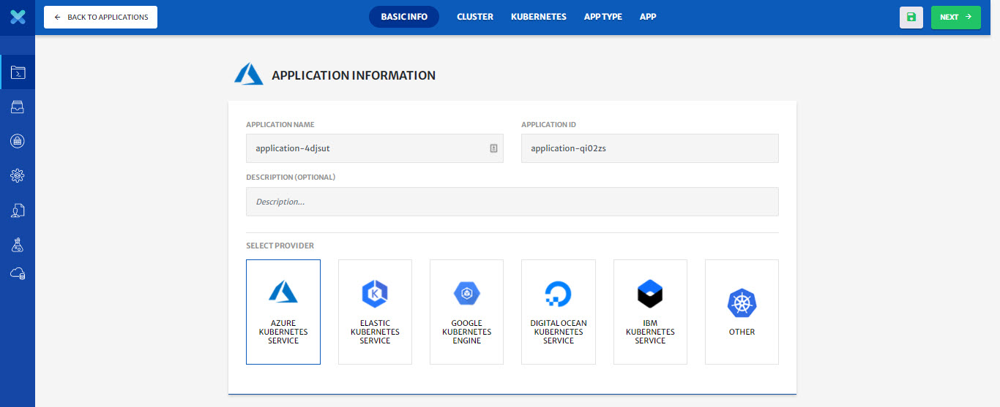
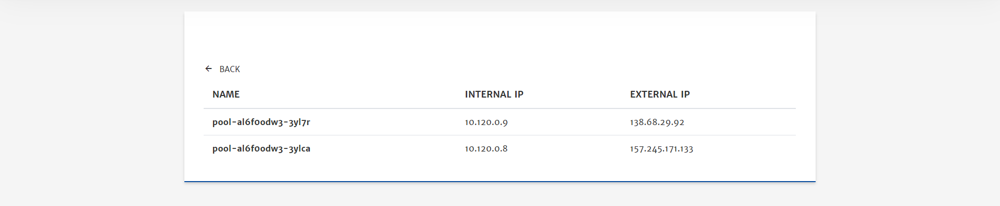

## Provider Managed - Existing Kubernetes Cluster

> To deploy an application on cloud, it is necessary for the user cloud profile to have all the required permissions. For detailed guide on all the required permissions, click [here](/pages/user-guide/components/cloud-authorization-level/cloud-authorization-level).

1. **Select** Use Existing Kubernetes Cluster from Provided Managed section.  

2. Configure the **Basic Info** tab. (Platform provides default values for most of the parameters)

   - Select the **Cloud Provider**. (For this guide we have selected Azure Kubernetes Service)

   

3. Click **Next** at the top right of screen.

4. Configure **Cluster**.
   From here you can connect your existing kubernetes cluster with CloudPlex.  

   - Download YML file. 

   - Configure kubectl (client) with your existing kubernetes cluster that you want to import. 

   - Run following command on downloaded YML file. 

     ```
     kubectl apply -f agent.yml
     ```

   > Download Config file of the cluster from the cloud and apply agent on that as shown in the picture below.

   

   - Once pod is in running state, click **Verify Connect** to verify the connection with cluster. 

   

5. Click **Next** at the top right of screen.

6. Select **App Type**.
   **Select New Application**: To deploy new CloudPlex managed application on existing kubernetes cluster. (creating new application as part of this guide)
   **Select Existing Application:** To migrate application from any kubernetes cluster to CloudPlex. 

   

7. Click **Next** at the top right of screen.

