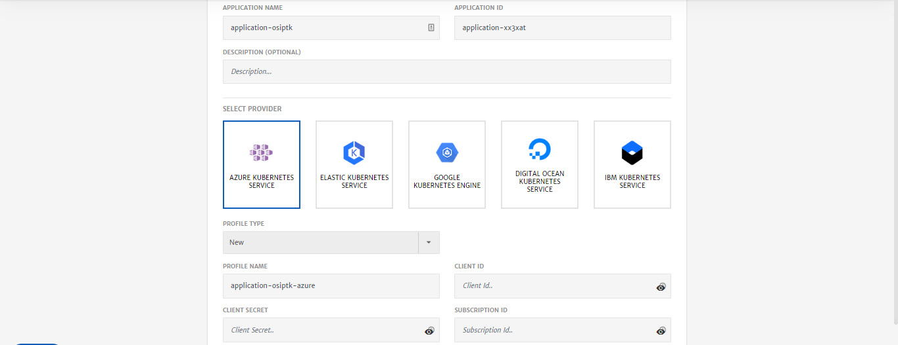
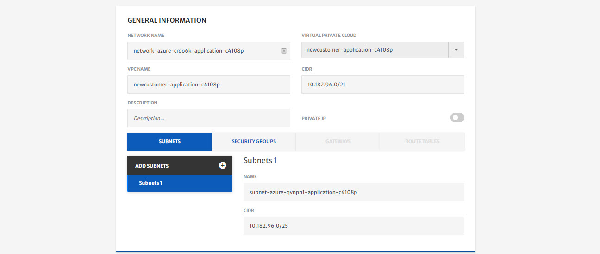
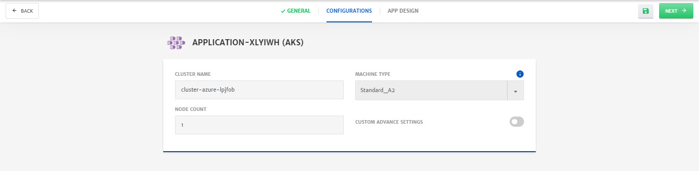

## Provider Managed - New Kubernetes Cluster

> To deploy an application on cloud, it is necessary for the user cloud profile to have all the required permissions. For detailed guide on all the required permissions, click [here](/pages/user-guide/components/cloud-authorization-level/cloud-authorization-level).

1. **Select** Create New Kubernetes Cluster from Provided Managed section.  

2. Configure the **General** tab. (Platform provides default values for most of the parameters)

   - Select the **Cloud Provider** and specify necessary account details for the account. (For this guide we have selected Azure Kubernetes Service)

   - Enter **Profile Name** and specify the Azure profile credentials (Client ID, Client Secret, Subscription ID, Tenant ID). You can also save this profile for future use. Credentials will be stored in vault i.e. Credentials Profile menu.

     > To know more about Credentials Profile menu, click [here](/pages/user-guide/components/credentials-profile/credentials-profile).
     >
     > To perform different functions and to deploy application using CloudPlex, it is necessary to have required permissions on cloud. To know about all those permissions click [here.](pages/user-guide/components/cloud-authorization-level/cloud-authorization-level?id=cloud-authorization-level)

   

3. Click **Next** at the top right of screen.

4. Customize **Network** configurations as per requirements.

   > Most of the fields are prepopulated with default values but you can also customize the configurations as per your requirements.

   - Specify VPC **CIDR**.

   - Specify Subnet **CIDR**. (You can also add multiple subnets by clicking the **+** icon)

   - (Optional) Go to **Security Groups** tab, to add Inbound or Outbound traffic rules. Platform provides preconfigured traffic rules, but you can customize them as per the requirements.

     

5. Click **Next** at the top right of screen.

6. Configure Cluster using **Configurations** tab.

   - Enter **Cluster Name**.

   - Select Machine Type from drop-down. (To know more about machine types click [here](https://azure.microsoft.com/en-us/pricing/details/virtual-machines/series/))

     > Minimum 4 CPU machine is needed for deployment. 

   - Specify **Node Count**.

   - (Optional) Enable **Custom Advance Settings** using radio button.

     > To configure advanced settings for Clusters, click [here](/pages/user-guide/components/cluster/pm-new-cluster/pm-new-cluster).

   

7. Click **Next** at the top right of screen.

