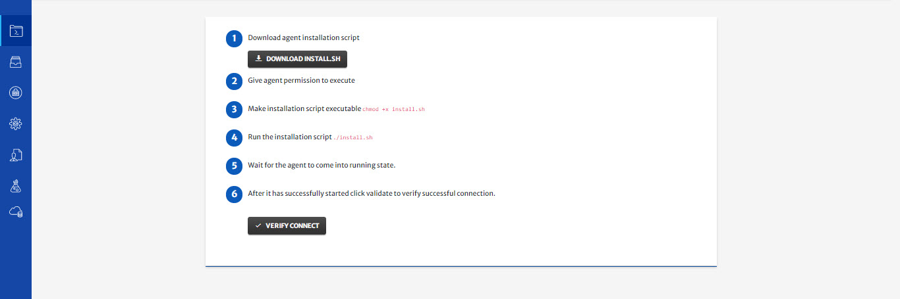

## User Managed - New On-Premise Kubernetes Cluster

> To deploy an application on cloud, it is necessary for the user cloud profile to have all the required permissions. For detailed guide on all the required permissions, click [here](/pages/user-guide/components/cloud-authorization-level/cloud-authorization-level).

1. **Select** Create New On-Premise Kubernetes Cluster from User Managed section.  

2. Configure the **Basic Info** tab. (Platform has provided default values for most of the parameters)

   

3. Click **Next** at the top right of screen.

4. Configure **Cluster**.

   - Specify **Username**, **Public IP** and **SSH Key** for the on-prem cluster.

     > You can also use existing Cloud instances, e.g. AWS EC2, Azure VM etc, to setup on-prem cluster.

   

5. Click **Next** at the top right of screen.

6. **Setup** cluster.

   From here you can connect your on-prem cluster with CloudPlex.  (Follow on screen instructions to install agent on your machine)

   

   - Once agent is in running state, click **Verify Connect** to verify the connection with cluster.

7. Click **Next** at the top right of screen.

8. (Optional) Configure **Kubernetes**.

   - Select **Kubernetes, Istio, Knative Version** from drop-down to install on cluster.

   - Specify **Pod Address Range** that will be assigned to the pods in cluster.

   - Use Radio buttons to enable **Load Balancing**, **Network Policy**, **Ingress Controller** and **Monitoring**.

     > Before deploying application, system will first install kubernetes on cluster.

   

9. Click **Next** at the top right of screen.

