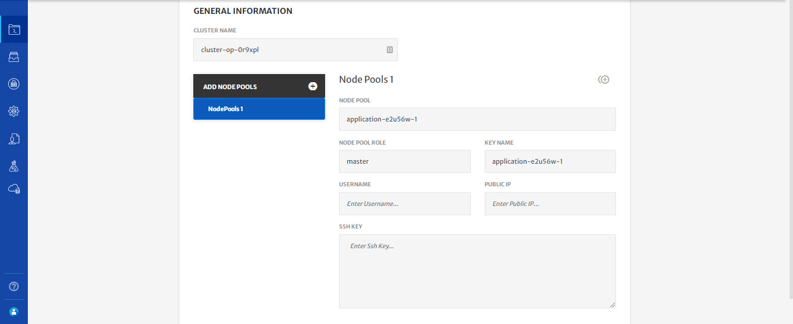
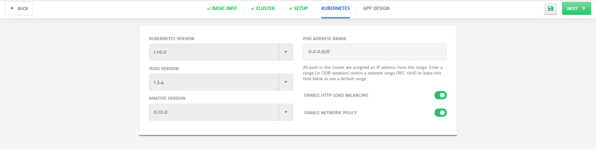
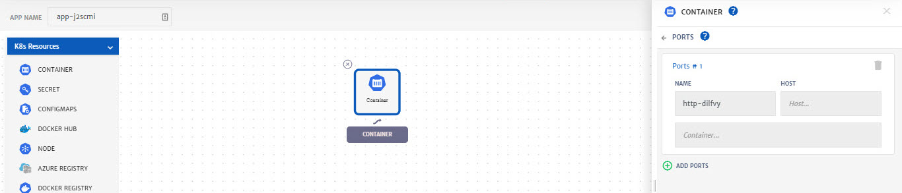

## User Managed - New On-Premise Kubernetes Cluster

1. **Select** Create New On-Premise Kubernetes Cluster from User Managed section.  

2. Configure the **Basic Info** tab. (Platform has provided default values for most of the parameters)

   

3. Click **Next** at the top right of screen.

4. Configure **Cluster**.

   - Specify **Username**, **Public IP** and **SSH Key** for the on-prem cluster.

     > You can also use existing Cloud instances, e.g. AWS EC2, Azure VM etc, to setup on-prem cluster.

   

5. Click **Next** at the top right of screen.

6. **Setup** cluster.

   From here you can connect your on-prem cluster with CloudPlex.  (Follow on screen instructions to install agent on your machine)

   

   - Once agent is in running state, click **Verify Connect** to verify the connection with cluster.

7. Click **Next** at the top right of screen.

8. (Optional) Configure **Kubernetes**.

   - Select **Kubernetes, Istio, Knative Version** from drop-down to install on cluster.

   - Specify **Pod Address Range** that will be assigned to the pods in cluster.

   - Use Radio buttons to enable **Load Balancing** and **Network Policy**.

     > Before deploying application, system will first install kubernetes on cluster.

   

9. Click **Next** at the top right of screen.

10. Design application using **App Designer**.

    > As part of this guide, we will only configure the minimum settings necessary to deploy the container. For detailed configurations, please check our detailed guide by clicking [here](/pages/user-guide/components/k8s-resources/container/container).

    - Drag and drop the **Container** service in K8s resources from left column in to the canvas.

    - Click on **Container** icon to configure the settings. (Platform has provided default values for most of the parameters) 

      - Specify **Image Name** and **Tag**.

      

      - Go to **Environment Variables** menu and **Add Static** Variable. It is necessary to add at least one variable which in our case is **MYSQL_ROOT_PASSWORD**.

      

      - Go to the **Ports**, click **Add Port** button and specify the port for Traffic i.e. **8080**.

      

      - Click **Save.**

11. Click **Save** (green floppy icon at the top right) to save the application.

    

12. Click **Start** to deploy the application.

    

13. Once an application is started, platform automatically redirect to **Logs** tab. Logs help in monitoring of different phases of application deployment.

    

14. To check in-depth flow of traffic, go to the **Monitoring** tab.

    
