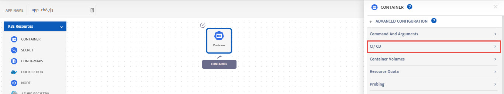

# Blue Green Deployment

Blue-green is a deployment technique that helps developer reduce risks and downtime by running two identical production environments called Blue and Green. This application release model gradually transfer user traffic from a previous version of an app (blue environment) to an identical new release (green environment) both of which run in production. 

Once production traffic is fully transferred from blue to green, blue can be pulled from production and updated to become the template upon which the next update can be made.

This guide explains step by step process of setting up a blue-green deployment.

1. Go the **App Design** tab while configuring an **Application** and add container.

2. Select container to configure it, go to the **Advanced Settings** and select **CI/CD**.

   

3. **Enable CI/CD** and click **Configure Pipeline**. 

   > Web hooks can also be used for CI/CD.

   

4. Enter **Pipeline Name**, **Pipeline Description** and select the **Type** from drop-down i.e. **bluegreen**. 

   

5. Configure pipeline by specifying the traffic weight for **BlueGreen** and **Current** release and click **Save**.

