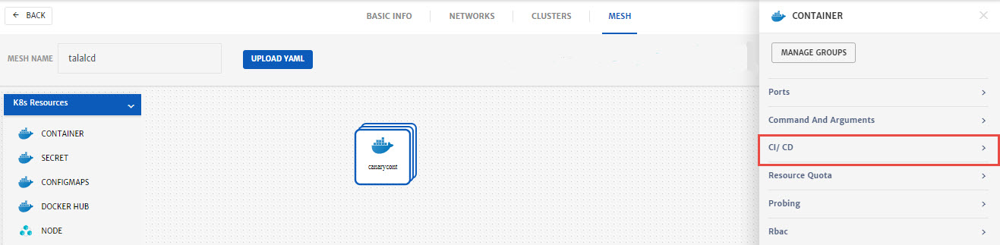
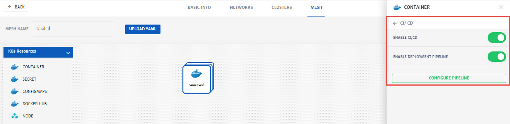
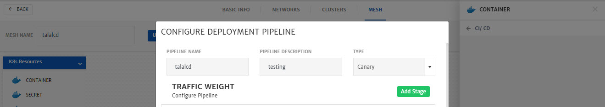
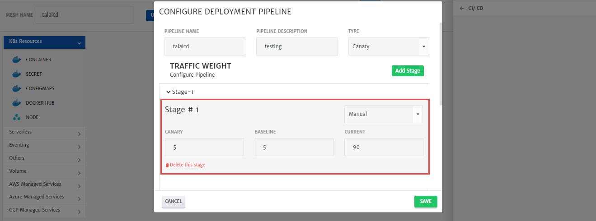
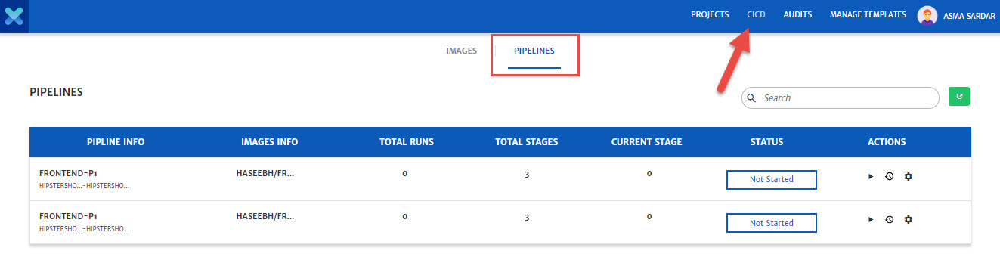
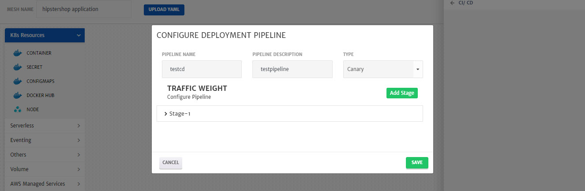

# Deploy Canary Release

This guide explains step by step process of deploying a multi stage canary release. Canary deployment can be automated and manual. 

**Multi Stage Canary:** Enabled rapid development iterations for services while meeting requirements of downtime-free deployments and a stable development to production pipeline. An architecture that can run hundreds of containers and meets requirements such as:

1. Zero downtime deployments
2. Continuous deployment to production
3. High stability of deployed services

To cater above requirements, a multi stage canary pipeline can be configured which will make sure that each microservice will be simultaneously deployed to production and keep the changes away from production until the build proves itself to work reliably and correctly on staging environment before applying it to production environment.

**Manual Canary Deployment:**

To configure CI/CD or manual deployment pipeline:

1. Go the **App Design** tab while configuring an **Application** and add container.

2. Select container to configure it, go to the **Advanced Settings** and select **CI/CD**.

   

3. **Enable CI/CD** and click **Configure Pipeline**. 

   > Web hooks can also be used for CI/CD.

   

4. Enter **Pipeline Name**, **Pipeline Description** and select the **Type** from drop-down i.e. **Canary**. 

   To configure **Traffic Weight**, click **Add Stage**. You can add multiple stages as well. 

   

5. Select **Manual** from drop-down. Specify **Canary**, **Baseline** and **Current** threshold. 

   Similarly, you can add more stages as well and keep on increasing the threshold level as per requirements. 

   

6. Click **Save**, configure the rest of services and deploy the Application. 

7. Go to the **CICD** menu from top bar and click **Pipelines**. 

   All the pipelines created will be listed here. 

   

8. Using the **Actions** button, you can start pipeline or check the configurations of pipelines. 

   > Table will be updated based on deployment. In case of manual, you will have to manually run the pipeline for each stage.

**Automated Canary Deployment:**

To configure CI/CD or manual deployment pipeline:

1. Go the **App Design** tab while configuring an **Application** and add container.

2. Select container to configure it, go to the **Advanced Settings** and select **CI/CD**.

   

3. **Enable CI/CD** or **Deployment Pipeline** and click **Configure Pipeline**. 

   > **Note:** Web hooks can be used for CI/CD and deployment pipeline. 

   

4. Enter **Pipeline Name**, **Pipeline Description** and select the **Type** from drop-down i.e. **Canary**. 

   To configure **Traffic Weight**, click **Add Stage**. You can add multiple stages as well. 

   

5. Select **Auto** from drop-down and specify **Canary**. System will automatically adjust **Baseline** and **Current** threshold. 

   > **Success Threshold** is a percentage of successful request to be considered as success for this stage. In case percentage of successful requests is less than threshold value, deployment wont move to next stage
   >
   > **Latency** is in milliseconds. Stage will be successful if average latency of 50% of requests is less than the threshold value. Otherwise deployment wont move to next step. 
   >
   > **CRON Expression:** To set time and date when the system will check whether the thresholds are met or not. 

   Similarly, you can add more stages as well and keep on increasing the threshold level as per requirements. 

   

6. Click **Save**, configure the rest of service and deploy the Application. 

7. Go to the **CICD** menu from top bar and click **Pipelines**. 

   All the pipelines created will be listed here. 

   

8. Using the **Actions** button, you can start pipeline or check the configurations of pipelines. Table will be updated based on deployment. 

   > For auto pipeline, you need to start the pipeline once using this menu. Once the pipeline is started it will continue to deploy automatically.  
   >
   > In case there are some manual and some auto stages in deployment pipeline, then you will have to manually mark the status as success etc for every manual stage.
   >