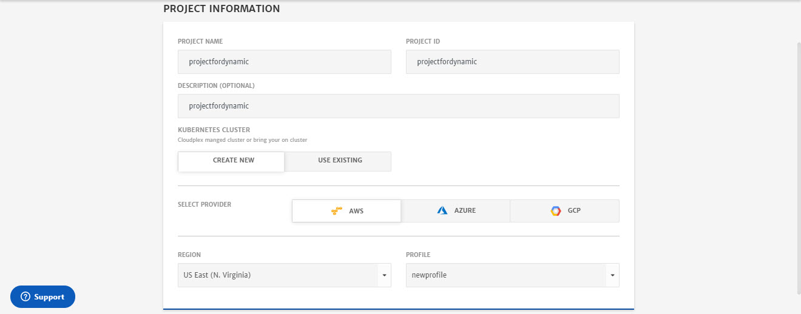
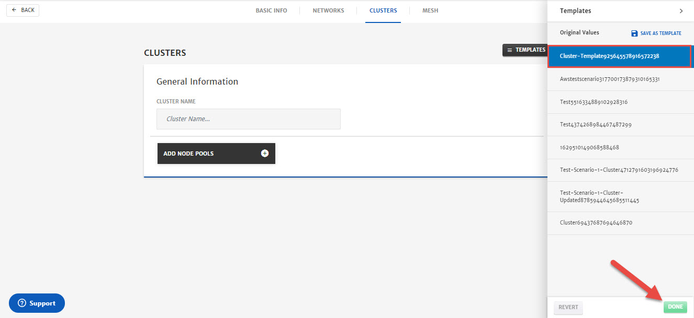
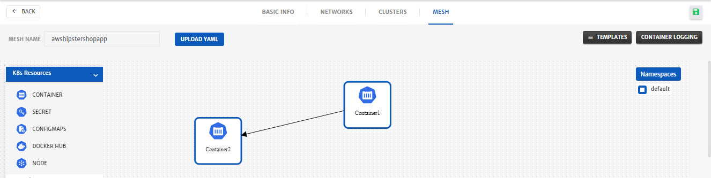
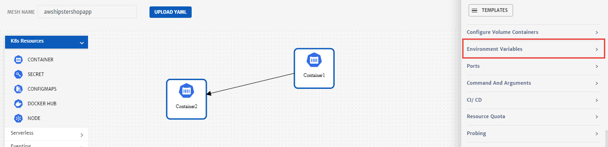
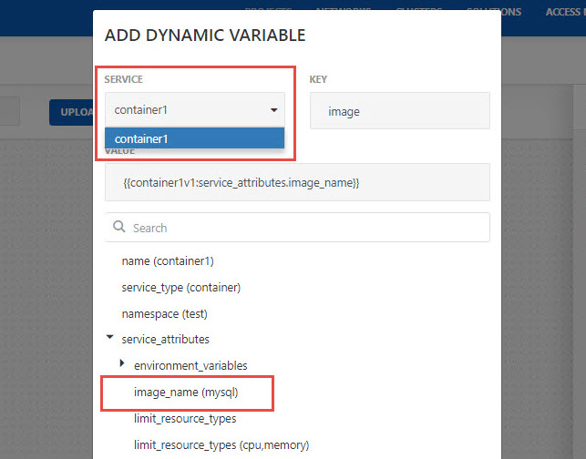
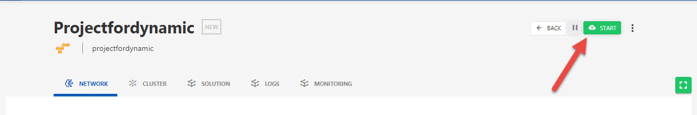

# Deployment Using Dynamic Variables

1. Login to Mega Mesh and click the green **+** icon to start the project creation wizard. 

   

2. Configure the **Basic Info** tab.

   - Enter **Project Name** and **Project ID**.
   - Enter **Description**.
   - Select the **Cloud Provider** and specify necessary account details for the account.
   - Select **Region** as per requirements.
   - Select any saved **Profile** from the drop-down or enter the credentials manually. 

   

3. Click **Next**.

4. Configure **Networks**.

   - Click **Templates** button to get the list of saved templates.

   

   - Select any saved template and click **Apply**.

   

   - Now that template is selected, click **Next**.

   

5. Configure **Clusters**.

   - Click **Templates** button to get the list of saved templates.

   

   - Select any saved template and click **Apply**.

   

   - Now that template is selected, click **Next**.

   

6. Configure **Solutions**.

   - Drag and drop 2 **Containers** in the package canvas from left column and create dependency between the two using arrow.

     > **Note:** Dynamic variables can only be used in the service that will be executed once the first service is deployed and connected using arrow i.e. container 2 in picture below.
     >
     > As container 2 is dependent on container 1, it will be deployed once container 1 is in running state, we can use dynamic variables in container 2 to fetch different values on runtime from container 1.

   

   - Click on **Container** icons to configure the settings.
   - To use dynamic variables, click on Container 2 icon and scroll down to **Add Dynamic Variables** button.

   

   - Configure Dynamic Variable.

     - Select **Service** from drop-down. 

       > **Note:** Only those services will be listed from which values can** be fetched which in our case was container 1

     - Specify **Key**.

     - Dynamic Variables that can be used are listed below. Select any variable from the list, system will automatically generate the dynamic variable and populate the Value.

     - Click **Save**

   

   - Dynamic Variable will now be added. Complete rest of the configurations and click **Save**.

   

7. Click **Save** (green floppy icon at the top right) to save the project.

   

8. Click the Project, you just created. 

   

9. Click **Start** to deploy the project

   