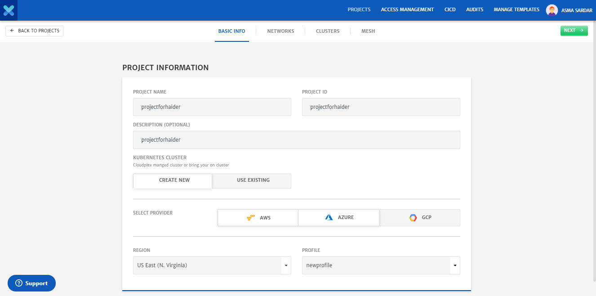
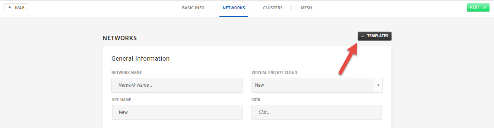
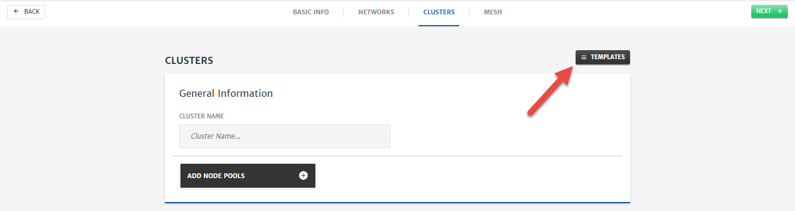
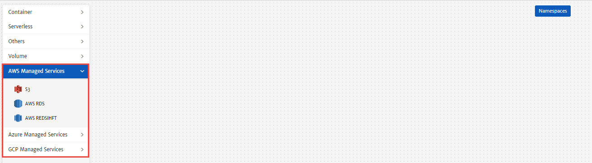
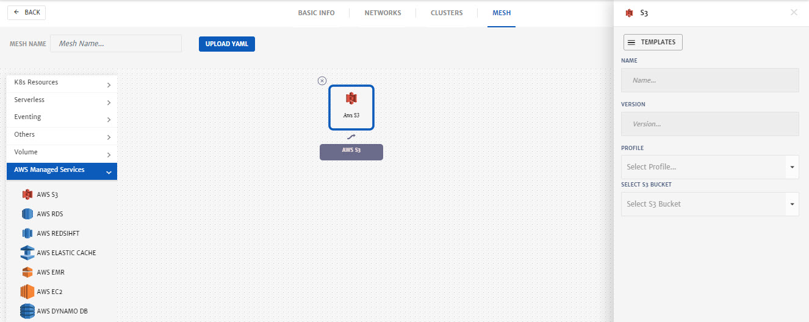
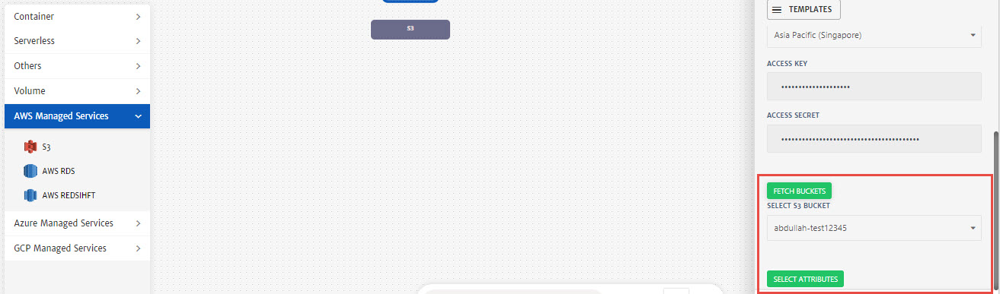
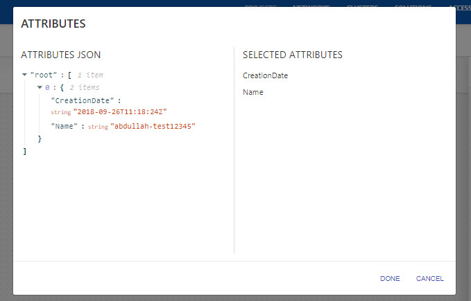
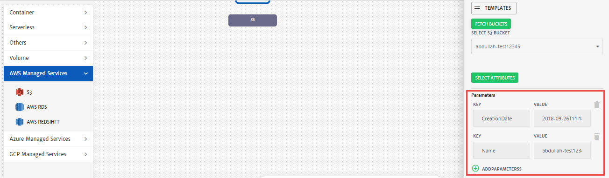

# Managed Services Consumption

1. Login to CloudPlex and click the **green +** icon to start the project creation wizard. 
   

2. Configure the **Basic Info** tab.

   - Enter **Project Name** and **Project ID**.
   - Enter **Description**.
   - Select the **Cloud Provider** and specify necessary account details for the account.
   - Select **Region** as per requirements.
   - Select any saved **Profile** from the drop-down or enter the credentials manually. 

   

3. Click **Next**.

4. Configure **Networks**.

   - Click **Templates** button to get the list of saved templates.

   

   - Select any saved template and click **Apply**.

   

   - Now that template is selected, click **Next**.

   

5. Configure **Clusters**.

   - Click **Templates** button to get the list of saved templates.

   

   - Select any saved template and click **Apply**.

   

   - Now that template is selected, click **Next**.

   

6. Configure **App**.

   - Go to Cloud **Managed Services** drop-down to get the list of services currently supported in platform.

   

   - Drag and drop the required service in solution canvas and configure it. 

     > **Note:** Process of configuration is the same for all the services. 

   - Enter the **Name** and **Version** for the service. 

   

   - Select **Profile** from drop-down and click **Fetch Buckets** to fetch the buckets for AWS.

     > **Note:** For RDS and RedShift, Instances will be fetched.

   - Select **S3 Bucket** from the drop-down.

   

   - Click **Select Attributes**, click on the attribute value and click **Done** to add it as Dynamic Variable. 

   
   

   - You can also add other parameters by clicking **Add Parameters** button.

7. Click **Save** to save the service. You can now use these variables to configure other services in your app.