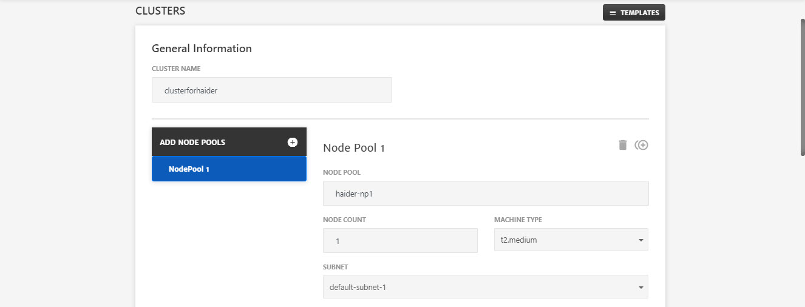
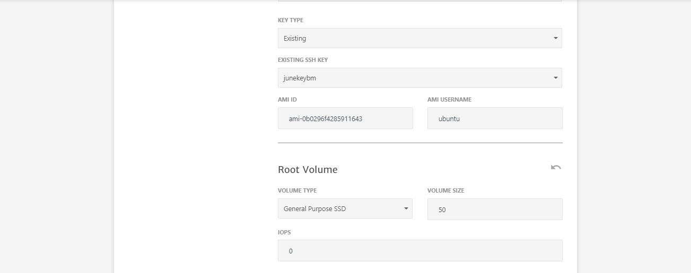
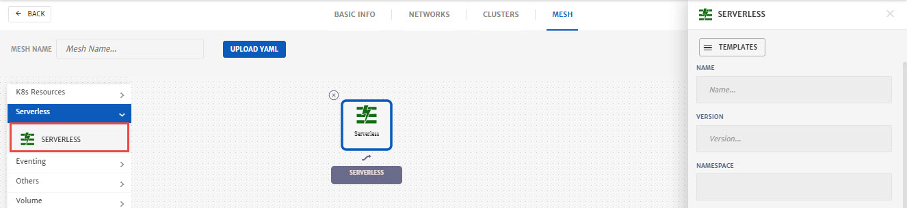
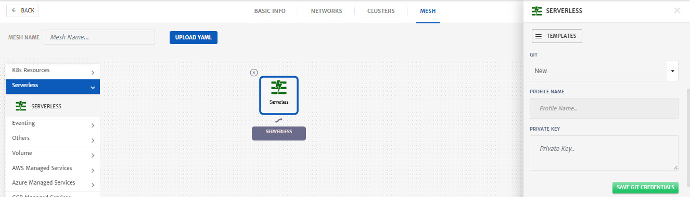
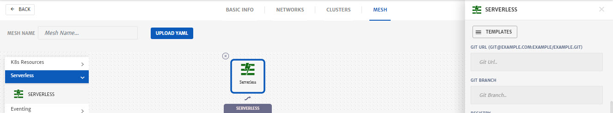
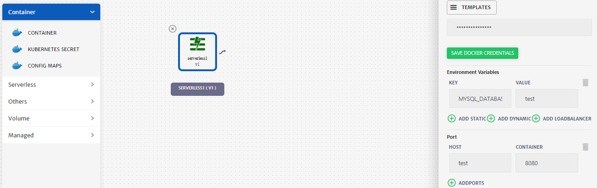
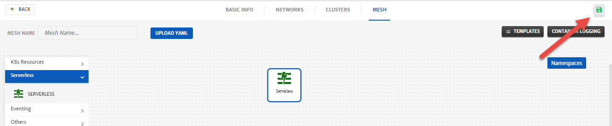

# Deployment of Serverless Solution

1. Login to Mega Mesh and click the green **+** icon to start the project creation wizard. 

   

2. Configure the **Basic Info** tab.

   - Enter **Project Name** and **Project ID**.
   - Enter **Description**.
   - Select the **Cloud Provider** and specify necessary account details for the account.
   - Select **Region** as per requirements.
   - Select any saved **Profile** from the drop-down or enter the credentials manually. 

   

3. Click **Next**.

4. Configure **Networks**.

   - Enter **Network Name**.

   - Select **Virtual Private Cloud** from dropdown i.e. **New** or some existing network. (Existing networks will be listed based on account selected)

     > **Note:** This guide explains the process of New Network Creation, for existing you just need to select Subnet etc from drop-down.

   - Enter **VPC Name**. 

   - Specify **VPC CIDR**.

   

   - To add Subnet, go to the **Subnets** tab, click **+** icon and specify the **Subnet Name** and **CIDR**.

   

   - To add Security Group (SG), go to the **Security Groups** tab.
   - Specify the **SG Name** and **Description**.
     - Click the **+** icon on the **TEST-SG** button to add Traffic Rules. (You can add multiple rules as well)
     - Select the **Rule Type** as per requirement i.e. **Inbound** or **Outbound**.
     - Specify the **IP Protocol** i.e. TCP, UDP etc.
     - Specify the **Source** and **Destination** **Ports**.
     - Specify the **Port Range** that will be exposed to traffic.
     - Add **IP Ranges** in CIDR notation.

   

   

5. Click **Next**.

6. Configure **Clusters**.

   - Enter **Cluster Name** and click **Add Node Pools** button.
   - Enter **Node Pool** name.
   - Select **Machine Type** from the dropdown and specify **Node Count**.
   - Select **Subnet** from dropdown to associate with node pool.

   

   - Select **Security Groups** from dropdown.
   - Select **Key Type** from dropdown i.e. **Existing** in this case.
   - Specify the **AMI ID** and **AMI Username**.
   - For **Root Volume** of node, select **Volume Type** from drop-down.
   - Specify the **Volume Size** and **IOPS** for volume. 

   

   - (Optional) Use to toggle button to use **Docker Data Volume** and select the **Volume Type**, **Volume Size** and **IOPS**.
     - Check **Delete on Termination** to delete the volume on Project termination. 

   

7. Click **Next**.

8. Configure **Mesh**.

   - Drag and drop the **Serverless** in the package canvas from left column.

   - Click on **Serverless** icon to configure the settings.

     - Enter the **Name** and **Version**.
     - Enter **Namespace** or select any existing from drop-down.

     

     - From **GIT** drop-down select **New**.

     - Specify Git **Profile Name** and **Private Key**.

       > **Note:** Click **Save GIT Credentials** to store the credentials for future use.

     

     - Specify **Git URL** and **Git Branch**.

     

     - From **Registry** drop-down, click **New** and specify **Registry Name, Username** and **Password**. (Click **Save Docker Credentials** to use for future projects)
     - Specify **Image URL** and Registry **Tag**.

     

     - Add **Environment Variable**. It is necessary to add at least one which in our case is **MYSQL_DATABASE**
     - Click **Add Port +** button and specify the port for Traffic i.e. **8080**
     - Click **Save.**

     

9. Click **Save** (green floppy icon at the top right) to save the project.

   

10. Click the Project, you just created. 

    

11. Click **Start** to deploy the project.

    