# Deployment Using Saved Templates

1. Login to Ultramesh and click the green **+** icon to start the project creation wizard. 

   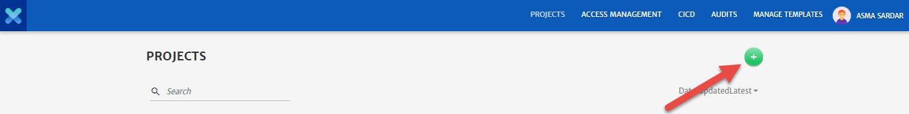

2. Configure the **Basic Info** tab.

   - Enter **Project Name** and **Project ID**.
   - Enter **Description**.
   - Select the **Cloud Provider** and specify necessary account details for the account.
   - Select **Region** as per requirements.
   - Select any saved **Profile** from the drop-down or enter the credentials manually. 

   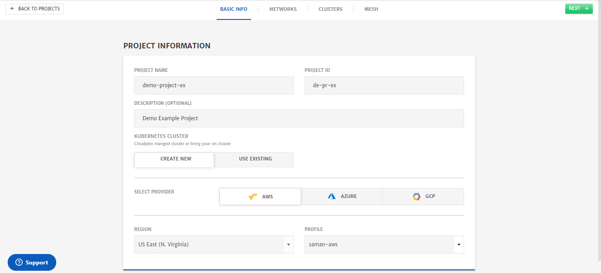

3. Click **Next**.

4. Configure **Networks**.

   - Click **Templates** button to get the list of saved templates.

   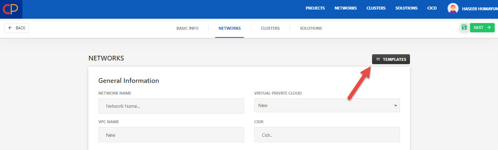

   - Select any saved template and click **Done**.

   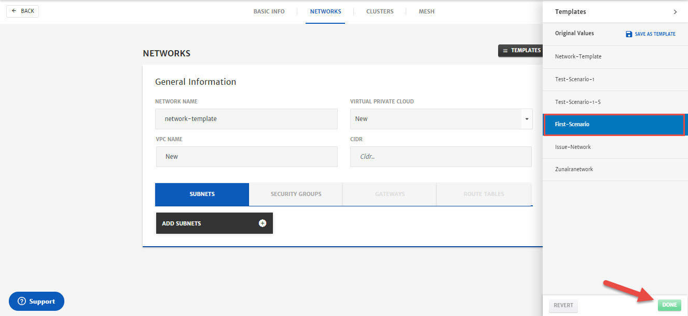

   - Now that template is selected, click **Next**.

   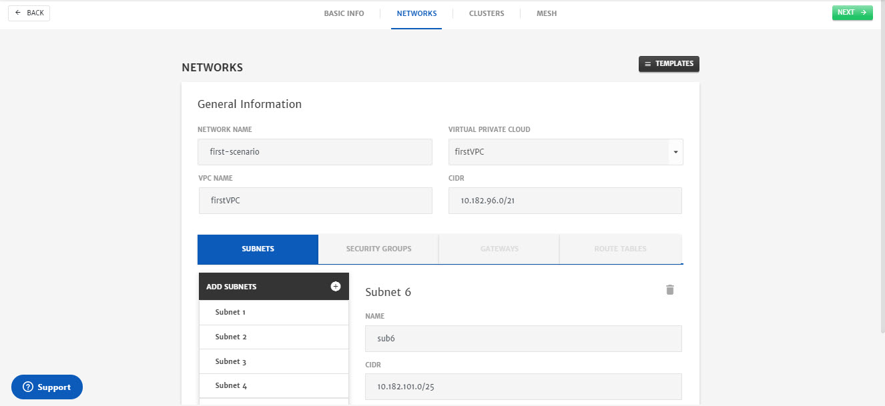

5. Configure **Clusters**.

   - Click **Templates** button to get the list of saved templates.

   

   - Select any saved template and click **Apply**.

   

   - Now that template is selected, click **Next**.

   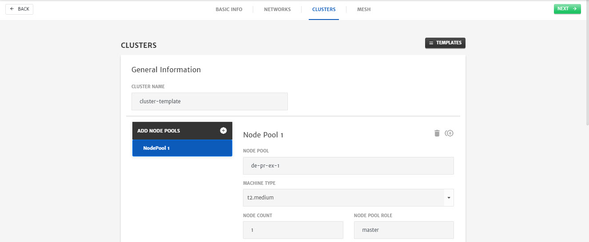

6. Configure **Mesh**.

   - Click **Templates** button to get the list of saved templates.

   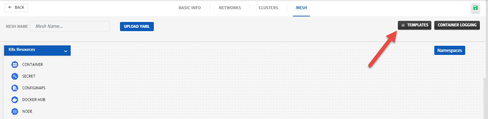

   - Select any saved template and click **Apply**.

   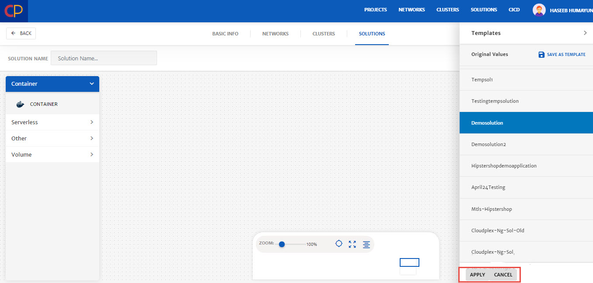

   - Now that template is selected, click **Save** (green floppy icon at the top right) to save project.

   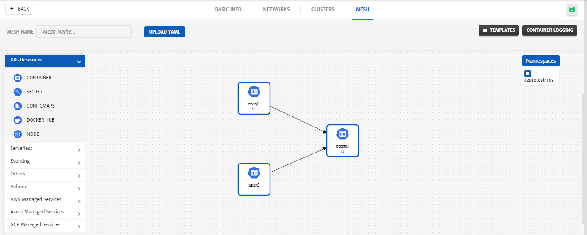

7. Click the Project, you just created. 

   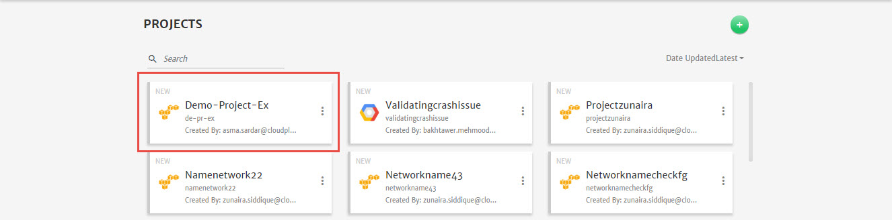

8. Click **Start** to deploy the project

   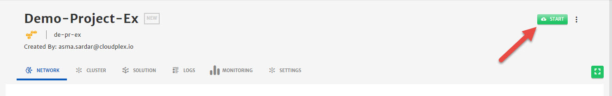

9. Go to the **Logs** tab to check logs related to the deployment.

   

10. To check the status of **Cluster**, **Network**, and **Solution**, go to the relevant tab.

    

    

11. Once the solution is deployed, go to the **Monitoring** tab to see detailed graphs related to Mesh performance.

    
