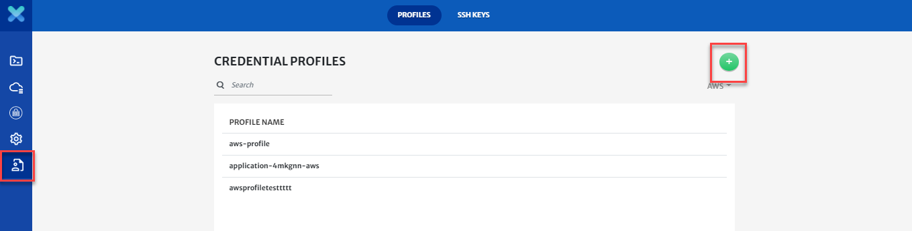

# Store and Manage Secrets with the Secure Vault

The purpose of this guide is to show you how to manage Secrets and protect Sensitive Data with the CloudPlex platform. CloudPlex integrates the HashiCorp vault. We use strong access control policies to keep your data secure at all times. It provides secrets management, data encryption, and identity-based access control to tokens, passwords, certificates, encryption keys for protecting secrets, and other sensitive data.

Now lets show you how to safely store cloud provider credentials in CloudPlex managed vault. For a video guide, please click [here](https://drive.google.com/file/d/1bcyJ7IA26jHYzQMInPKixaJBsLNHZF1n/view?usp=sharing).

**Store Credentials in CloudPlex Managed Vault**

1. To create a new profile select Credential profiles.

2. Click on the create new profile button and select your desired profile type.

   

3. For this video, let’s select AWS.

4. Provide basic information.

5. Provide your AWS credentials and save your profile.

   

6. All the sensitive information is stored in the CloudPlex managed vault.

7. The vault encrypts data in flight, and at rest and has strong access control policies to keep your data secure at all times. 

**Manage SSH Keys**

1. To create a new SSH key, go to the cluster tab.

   

2. Select New from key type dropdown.

3. Provide a name for the SSH key and click on the generate button.

   

4. CloudPlex will generate a 4096-bit key and store it in the vault.

5. Only you can access and manage your secrets in the vault.

6. CloudPlex gives you the option to download your generated key only at the time of generating. The key is not accessible after that.

   

7. The platform uses this SSH key to start your machines and deploy the CloudPlex agent on it.

8. You can use the downloaded key to manually access your deployed cluster.

**Store Sensitive Information Used in an Application**

Every application needs to be configured. The configuration parameters may include sensitive data that should not be exposed. It is not an acceptable security practice to save sensitive data within your container image. The CloudPlex platform provides a secrets service which is the interface to input sensitive data such as passwords, tokens, certificates, and ssh keys. Any data entered in a secrets service is encrypted and stored in a secure vault and also becomes part of Kubernetes secrets.

Let us show you how to store sensitive data using the CloudPlex secrets service. We will be adding the secret service to a MySQL application that is already configured.

1. Drag-n-Drop CloudPlex secrets service from pallet to the canvas and drag an arrow from the Secret service to the MySQl service to establish dependency.

   

2. Click on add new string secret.

3. In general you will provide the key, value pair as shown. CloudPlex gives you an option to paste sensitive data in the text field or directly upload a file. 

   

4. In this case our secret will be the MySQL password.

5. Click on Add secret string and type **MYSQL_ROOT_PASSWORD** in key and the Password in the value field. For this guide, type **5dzo2MsriVJNYTTtud8gOyDc3A** in the value field.

   

6. Click on save button to save service.

7. Click on save service and then click on the save application button.

8. Once you save the application, CloudPlex stores the secrets service data directly in the secure vault, and the rest of the application will be stored in the database, hence protecting your sensitive data.

**Conclusion**

Now you are all set to manage and protect your sensitive data with CloudPlex, the Kubernetes application platform for developers. 