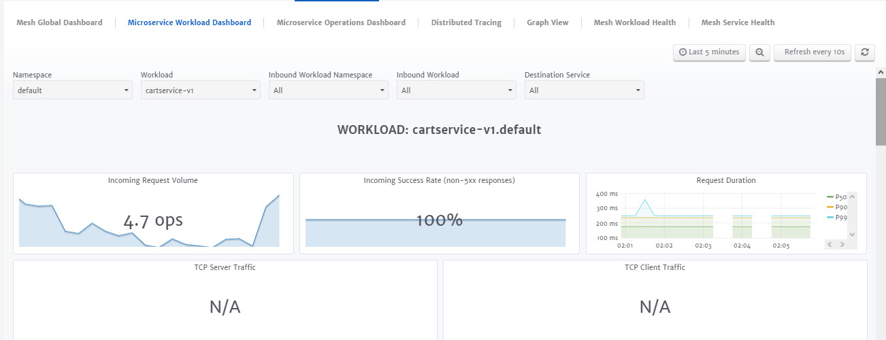
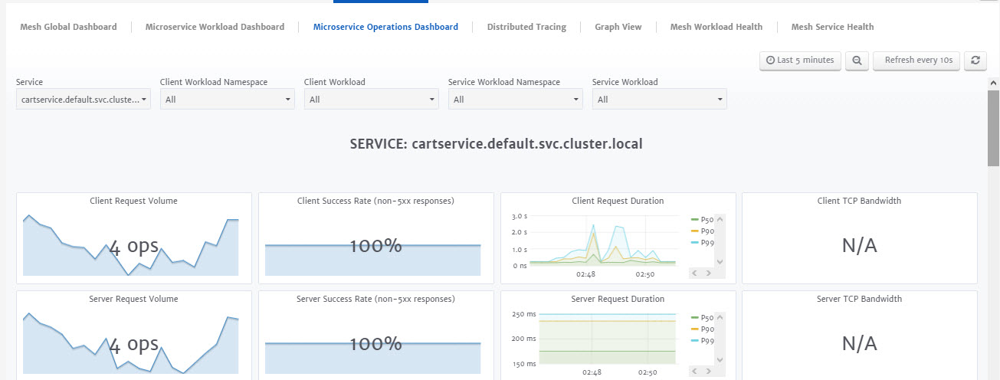
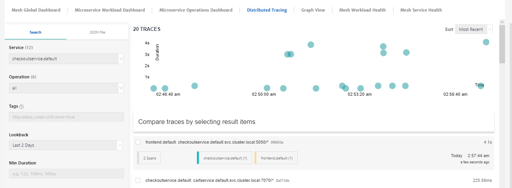
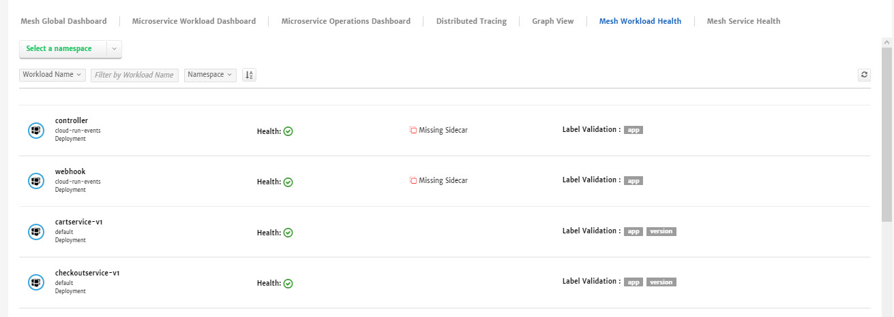
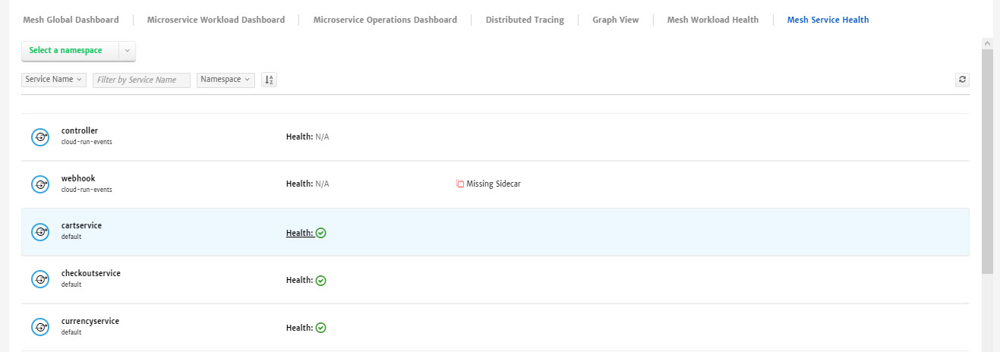
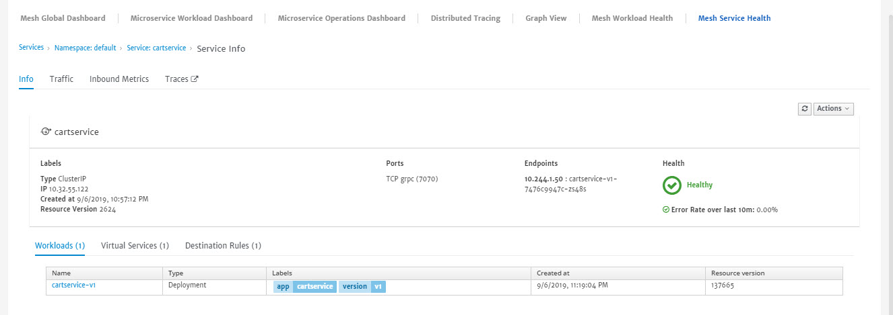

# Visualize & Trace Traffic

Distributed tracing is what provides a way to monitor and understand behavior of traffic by monitoring and visualizing requests as they flow through an app. These traces helps app operators in understanding the source of latency and services dependencies within the app. 

Integration with distributed tracing systems happens in two different ways: Envoy-based and Mixer-based tracing integrations. For both the approaches, applications forward the tracing headers for subsequent outgoing requests.

> **Envoy-Based Tracing:**  Envoy (the sidecar proxy) sends tracing data directly to tracing backends on behalf of the applications being proxied.
>
> **Mixer-Based Tracing:** Mixer provides the integration with tracing backends. Mixer integration allows additional levels of operator control of the distributed tracing, including fine-grained selection of the data included in trace spans. It also provides the ability to send traces to backends not supported by Envoy directly.

Number of tracing backends are also supported including Jaeger, LightStep, Zipkin, and Datadog. Operators control the sampling rate for trace generation (that is, the rate at which tracing data is generated per request). This gives operators further control of the amount and rate of tracing data being produced for their app.

Now, let's move to the brief overview of visualization options available in CloudPlex Monitoring.

1. **App Global Dashboard**: Dashboard providing details like workload type, success rate and requests for each of the service in the app. This dashboard presents complete global picture of the app. 

   

2. **Microservice Workload Dashboard**: Dashboard providing in-depth workload level metrics for individual services and namespaces. This dashboard also provides detailed data of requests of inbound and outbound workloads. 

   

3. **Microservice Operations Dashboard:** Dashboard providing in-depth operation level metrics for individual services and namespaces. It also provides detailed data of client and service workloads. 

   

4. **Distributed Tracing**: Dashboard to track a request through application that is distributed across multiple services. You can set the parameters or use a JSON file to find the traces for a service.

   

5. **Graph View**: Dashboard providing graphical representation for all the services/workloads in the app. You can get Service Graph, App Graph, Workload Graph and Versioned App Graph. Display of the graph can also be set based on Node Names, Traffic Animation, Unused Nodes or Badges like Circuit Breakers, Virtual Services etc. 

   

   

6. **App Workload Health**: Dashboard providing health status for all the workloads. Data can be sorted based on namespaces, health status, workload type etc. Detailed metrics for Inbound, Outbound traffic can also be generated by selecting any specific workload. 

   

   

7. **App Service Workload**: Dashboard providing health status for all the services. Data can be sorted based on namespaces, health status etc. Detailed metrics of Traces, Traffic etc for individual services can also be generated by selecting any specific workload. 