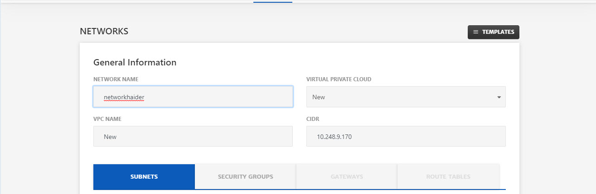
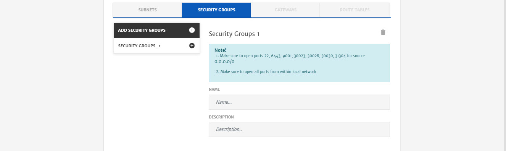
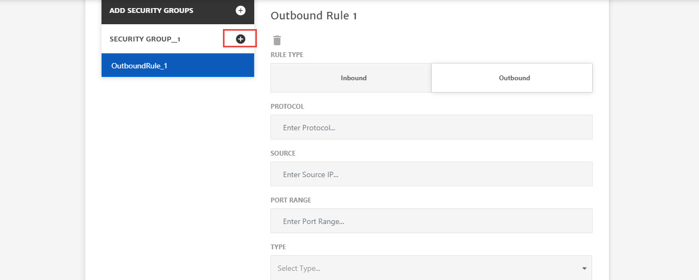
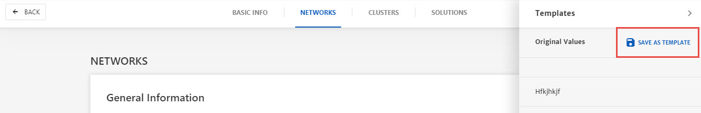
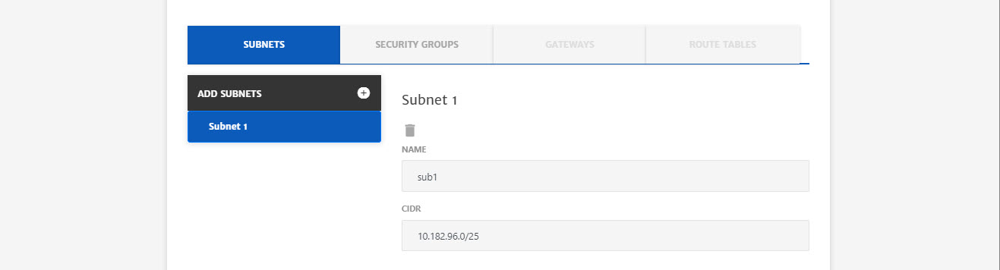
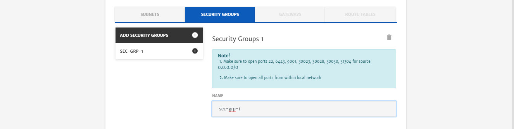
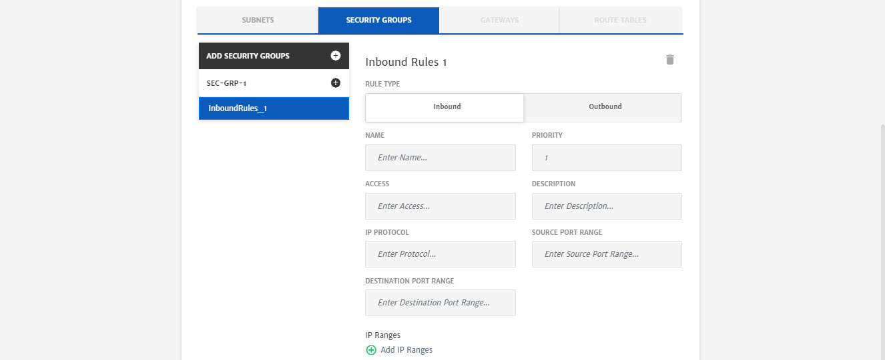
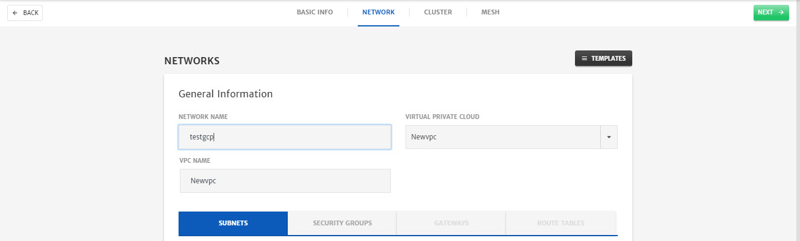
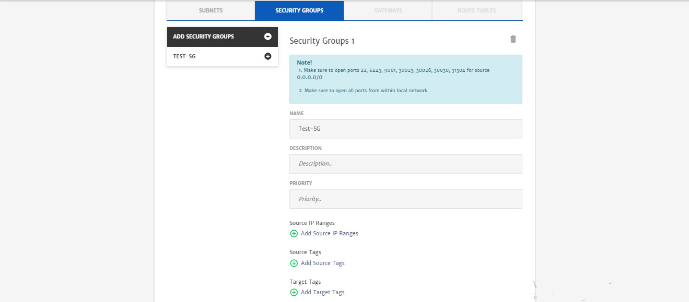
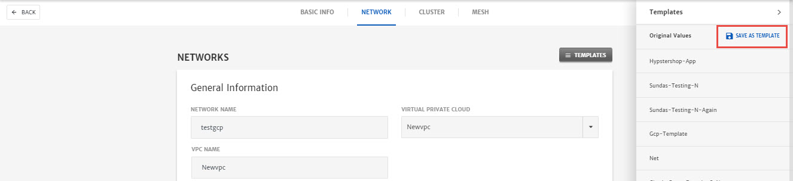

# Network

This section will explain the process of Network creation and all the relevant configurations for AWS, Azure and GCP. 

## AWS

Lets move to the step by step process of how to create an AWS network.

To configure a **Network**

1. Enter **Network Name**.

2. Select **Virtual Private Cloud** from dropdown i.e. **New** or some existing network. (Existing networks will be listed based on account selected)

   > **Note:** This guide explains the process of New Network Creation, for existing you just need to select Subnet etc from drop-down.

3. Enter **VPC Name**. 

4. Specify **VPC CIDR**.

   

5. To add Subnet, go to the **Subnets** tab, click **+** icon and specify the Subnet **Name** and **CIDR**. (You can add multiple Subnets as well)

   

6. To add Security Group (SG), go to the **Security Groups** tab and click **+** icon . (You can add multiple SGs as well)

7. Enter Security Group **Name** and **Description**.

   

8. Click the **+** icon on the **Security Group_1** button to add Traffic Rules. (You can add multiple rules as well)

   1. Select the **Rule Type** as per requirement i.e. **Inbound** or **Outbound**.
   2. Specify the **IP Protocol** i.e. TCP, UDP etc.
   3. Specify the **Source** and **Destination** **Ports**.
   4. Specify the **Port Range** that will be exposed to traffic.
   5. Add **IP Ranges** in CIDR notation.

   

9. Click the **Templates** button on top and click **Save as Template** to save the configurations.

   

   ## Azure

   Lets move to the step by step process of how to create an Azure network.

   To configure a **Network**

   1. Enter **Network Name**.

   2. Select **Virtual Private Cloud** from dropdown i.e. **New** or some existing network. (Existing networks will be listed based on account selected)

      > **Note:** This guide explains the process of New Network Creation, for existing you just need to select Subnet etc from drop-down.

   3. Enter **VPC Name**. 

   4. Specify **VPC CIDR**.

      

   5. To add Subnet, go to the **Subnets** tab, click **+** icon and specify the Subnet **Name** and **CIDR**. (You can add multiple Subnets as well)

      

   6. To add Security Group (SG), go to the **Security Groups** tab and click **+** icon. (You can add multiple SGs as well)

   7. Enter Security Group **Name**.

      

   8. Click the **+** icon on the Security Group name button to add Traffic Rules. (You can add multiple rules as well)

      1. Select the **Rule Type** as per requirement i.e. **Inbound** or **Outbound**.
      2. Enter the rule **Name** and set the **Priority** of rule. (Priority should be greater than or equal to 100)
      3. Enter **Access** and any **Description** related to rule.
      4. Specify the **IP Protocol** i.e. TCP, UDP etc.
      5. Specify the **Source** and **Destination Ports Range**.
      6. Add **IP Ranges** in CIDR notation.

      

   9. Click the **Templates** button on top and click **Save as Template** to save the configurations.

      

## GCP

Lets move to the step by step process of how to create an GCP network.

To configure a **Network**

1. Enter **Network Name**.

2. Select **Virtual Private Cloud** from dropdown i.e. **New** or some existing network. (Existing networks will be listed based on account selected)

   > **Note:** This guide explains the process of New Network Creation, for existing you just need to select Subnet etc from drop-down.

3. Enter **VPC Name**. 

   

4. To add Subnet, go to the **Subnets** tab, click **+** icon and specify the Subnet **Name** and **CIDR**. (You can add multiple Subnets as well)

   

5. To add Security Group (SG), go to the **Security Groups** tab, click **+** icon and configure it. (You can add multiple SGs as well)

6. Enter Security Group **Name** and **Description.**

7. Set the **Priority**.

8. **Add Source IP Ranges** in CIDR notation.

9. **Add Source** and **Target Tags**. (They will appear while configuring the cluster as well)

   

10. Click the **+** icon on the Security Group name button to add Traffic Rules. (You can add multiple rules as well)

    1. Select the **Rule Type** as per requirement i.e. **Inbound** or **Outbound**.
    2. Specify the **IP Protocol** i.e. TCP, UDP etc.
    3. Specify the **Port Range.**
    4. Select the **Access** type from drop-down i.e. Allowed or Disallowed.

    

11. Click the **Templates** button on top and click **Save as Template** to save the configurations.

    