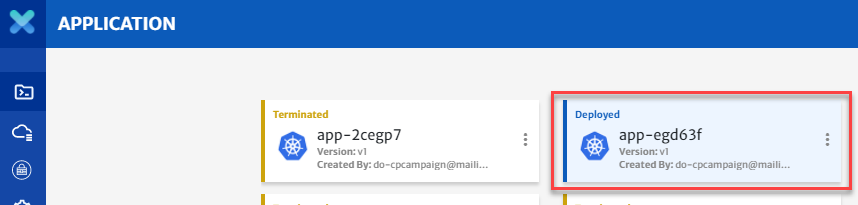
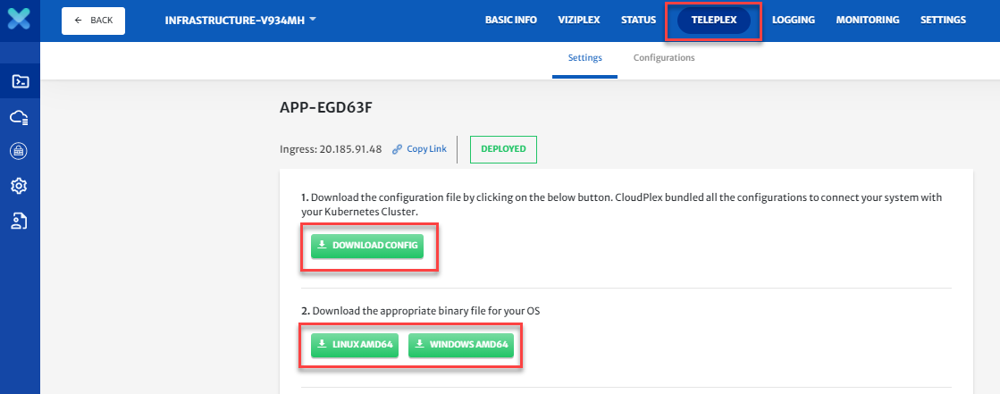
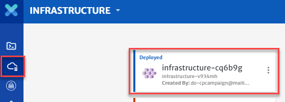
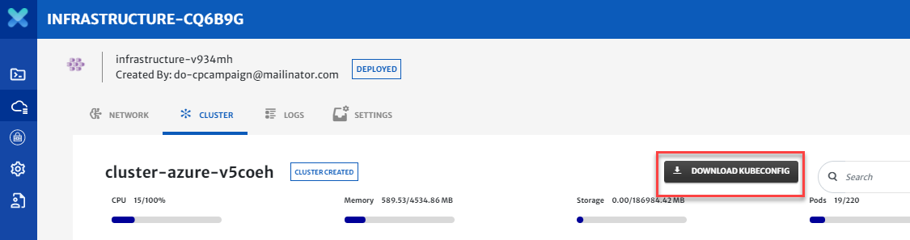
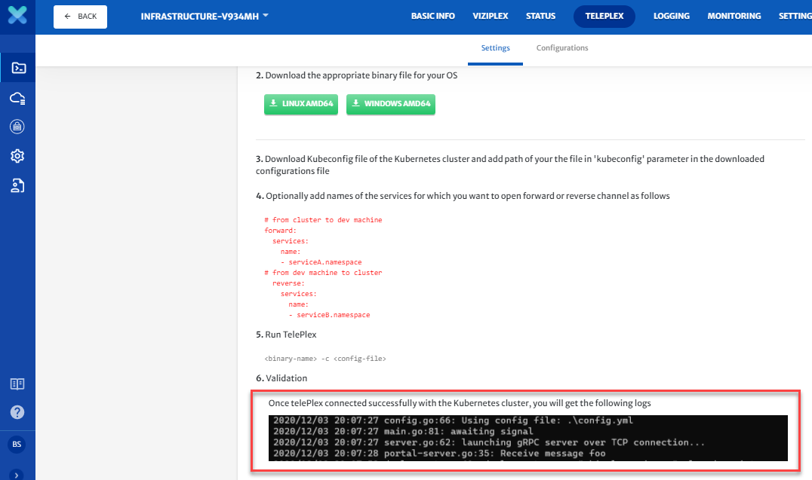
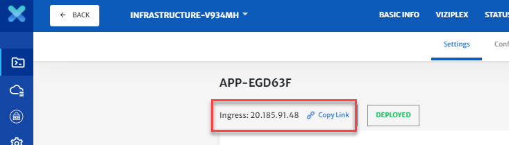
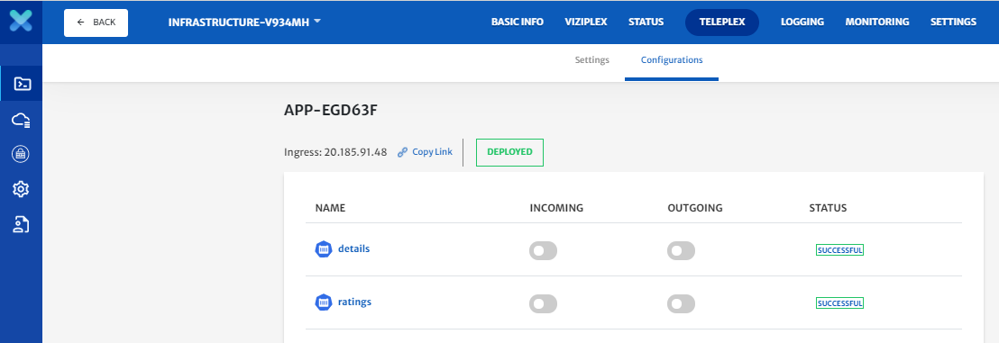

# Test and Debug your Applications

Developers need to test and debug their applications once it is designed, configured, built, and deployed on the dev cloud. The purpose of this guide is to take user thorough the process of application testing and debugging.

>  For our detailed guide on how to build an application, click [here](/pages/user-guide/tutorials/build-application-with-cloudplex/build-application-with-cloudplex?id=build-application-with-cloudplex).

To get started:

1. Navigate to ViziPlex and select any **Deployed** application

   

2. Navigate to TelePlex and install the TelePlex proxy.

   - Download the configuration file.

   - Download the correct binary file for your operating system.

     

   - Download the Kubeconfig file of your kubernetes cluster and add the path of your file with the kubeconfig parameter in the downloaded configurations file as shown on the screen.

     

     

   - Then run TelePlex using the command shown on the screen.

   - Once this validates you will see the logs shown on the screen.

     

   - Now we are ready to test and debug our application.

3. You can see the application is deployed on the cluster, now we will debug a new UI for the product page service. 

   

4. Once TelePlex is connected move to the configurations.
   From here you can change the traffic from the cluster to your local services and vice versaMake sure when doing so that the services you want to test are in running state on your local machine [Run productpage in VS Code] 

   

5. Switching the incoming traffic on for a service will route the incoming traffic to your local machine, and switching the outgoing traffic on will send traffic from your local machine to the services on the cluster.

6. This is how developers can test and debug the application directly from their IDEs to the cloud without repeatedly pushing, building, and deploying code to a kubernetes cluster.

7. From here you can step through your code calling the microservice and invoking API calls from your IDE.

8. As you can see now we are debugging the new UI.

9. The call is flowing from the calling microservice, through TelePlex, to the CloudPlex debugging dashboards, to the cloud, and then returning through the dashboards, through the TelePlex proxy to the called Microservice.

10. You can trace through the debugging dashboards to visually debug your application.

11. Here you can make use of the multiple debugging and diagnostics dashboards.

12. TelePlex works with various IDEs. First we showed you VS Code, and now we will show you IntelliJ, but TelePlex is not limited to these IDEs.

13. Now we will add the purchases service from our local machine. [show IntelliJ and purchases service]

14. Here we can see the purchase service is running now from our local machine. 

**Conclusion:**
Hopefully now you have an understanding of how to test and debug your applications with CloudPlex, the Kubernetes Application Platform for developers. 