# Use Dynamic Parameters

In order to pass parameter dynamically during deployment, CloudPlex introduced the idea of Dynamic parameters to make your application more flexible, not requiring hard coding of parameters every time. 

Dynamic parameters are runtime parameters that are replaced at the time of deployment. This type of parameter is helpful to templatize your work for reuse. For example, imagine you are using your own managed MySQL DB in your application during development but in Production, you want to use Cloud Provider managed DB, in that case, you just have to replace DB service and then because parameters are dynamic, no changes are required.

Now lets move to the configuration process. For a video guide, please click [here](https://drive.google.com/file/d/1KtgHqJkS1YJilxPUs2XPIJWT3vwC1G7t/view?usp=sharing).

**Set up basic Information** 

1. Click on the create new application button.

2. Select “Create New Application”.

   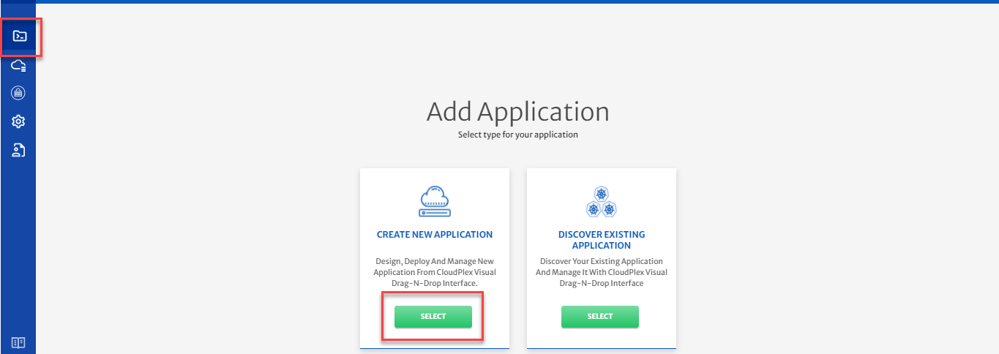

3. Provide basic information.

   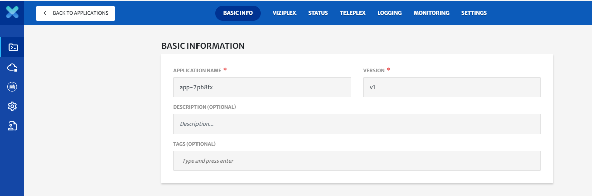

4. Click on the Next button.

**Configure the MySQL Secret Service**

1. CloudPlex platform provides a secret management service that provides the ability to store sensitive data such as passwords, tokens, and certificates in Cloudplex. Any data entered in this service is stored in a secure vault with at-rest encryption. This eventually becomes a Kubernetes secret in a deployed application.

2. To configure the service, Drag-n-drop Secret service from pallet to the canvas.

   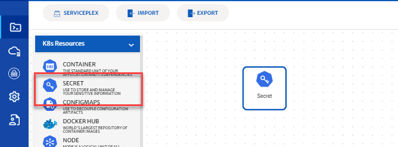

3. Click on the service to open the configuration panel on the right side.

4. The platform will populate the default values of service (Service Id, Service Name, Namespace)

5. Update Service Id and Service Name to **mysql-secret**.

6. By default, the type of secret is Opaque, you can choose different types according to your use case.

7. Click on Add secret string and type **MYSQL_ROOT_PASSWORD** in key and the Password in the value field. For this guide, type **5dzo2MsriVJNYTTtud8gOyDc3A** in the value field.

   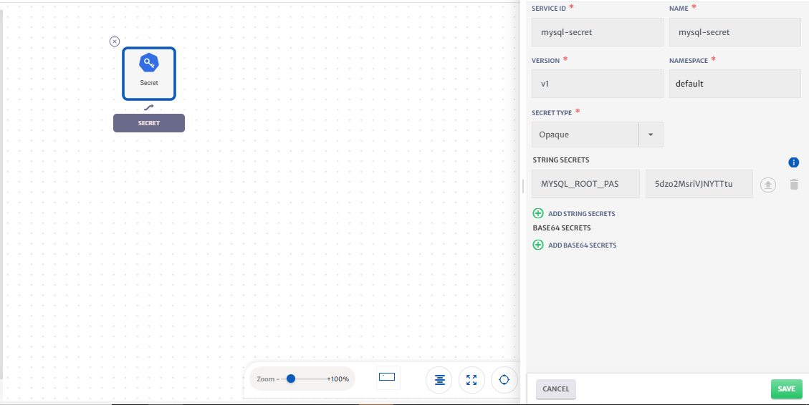

8. Click on save button to save service

**Configure the MySQL Container**

1. Drag-n-drop the **Docker Hub** service from pallet to the canvas.

2. Drag the arrow from Secret service to container service.

   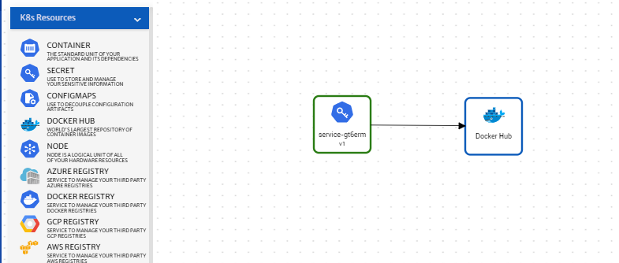

3. Click on the service to open the configuration panel on the right side.

4. Type **MySQL** in the search bar and click on the **search** button.

5. Select MySQL service.

   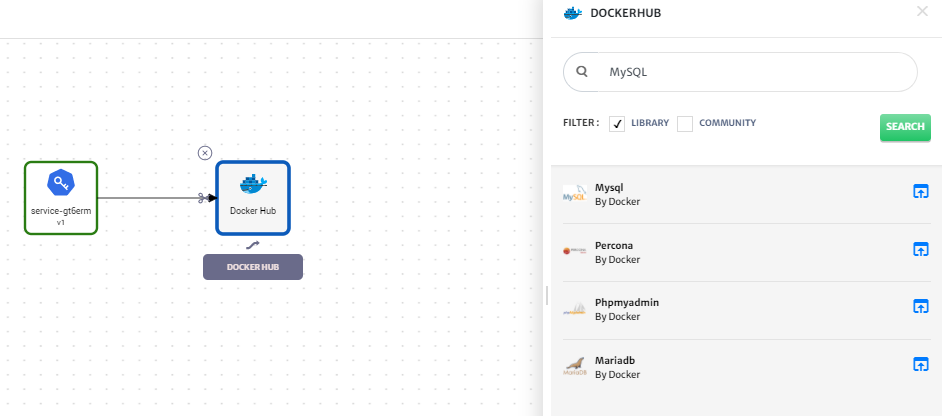

6. CloudPlex automatically pulls all the tags and metadata of the image and populates default values of service (Service Id, Service Name, Namespace, Type).

7. Go to **Environment Variables** tab. There are two types of environment variables, one is Static and other one is Dynamic. Static parameters are simple parameters in which you will provide your variables in key-value pair. For example, Port=80

   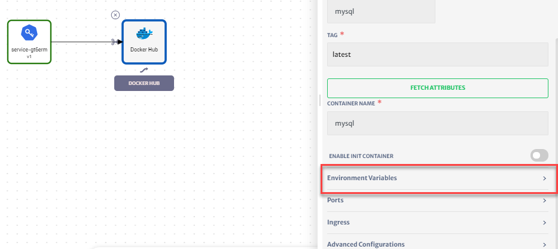

8. Click on Dynamic Parameters, Click on the dropdown, you will see different services. All the linked services and your own service are available in the dropdown. Now, select **mysql-secret.**

   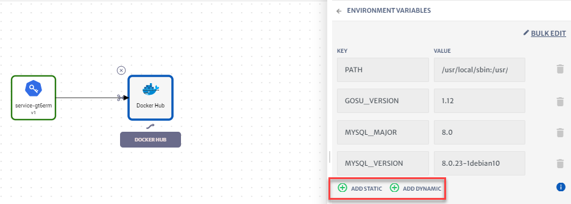

9. Type **MYSQL_ROOT_PASSWORD** in the key field.

10. Expand Service Attributes and Secrets Data and select **MYSQL_ROOT_PASSWORD.** Cloudplex automatically generates dynamic parameters for you.

    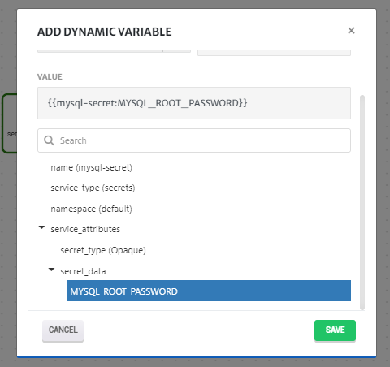

11. Click on the save button to save the parameters.

12. Click on the back button and click on the ports tab to configure ports.

13. Cloudplex automatically discovers ports from Docker images and populates them in the ports section of the service.

14. Click on the save button to save the service.

15. CloudPlex automatically generates the Kubernetes service manifest required for the service. If you want to modify any configuration, select the service and update it.

    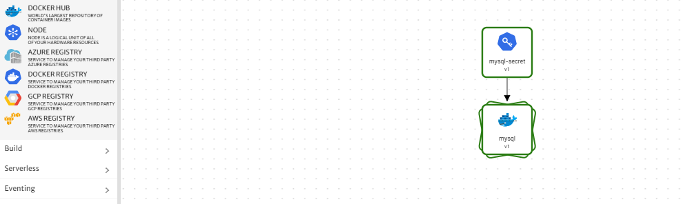

**Deploy MySQL on the cluster**

1. Before you deploy your application, define and configure the Kubernetes cluster you want to deploy it on.

   > For detailed guide, click [here](/pages/user-guide/getting-started/deploy-infrastructure-using-kubeplex/deploy-infrastructure-using-kubeplex?id=deploy-infrastructure-using-kubeplex).

2. Click on the **Deploy** button and select infrastructure to start deploying the application on using the infrastructure you created with KubePlex.

   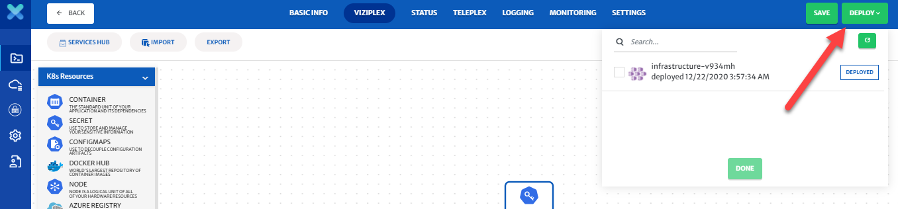

3. You will see logs as the application deployment progresses.

   

4. Go the **KubePlex** tab from left bar, select the **Deployed** infrastructure and click on the **Cluster** tab to see the live status of your cluster.

   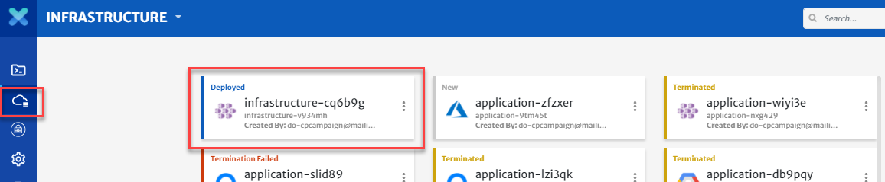

5. “Cluster live status” is a complete dashboard that gives you the “live status” about the health and consumption of the nodes in your cluster.

   

6. You can see the status of the application you just deployed by clicking on the **ViziPlex** tab from left bar, select the **Deployed** application and navigate to the status page to see the real time status of the MySQL service.

   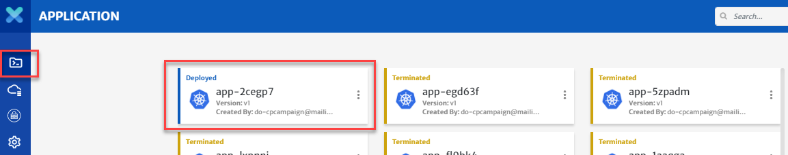

   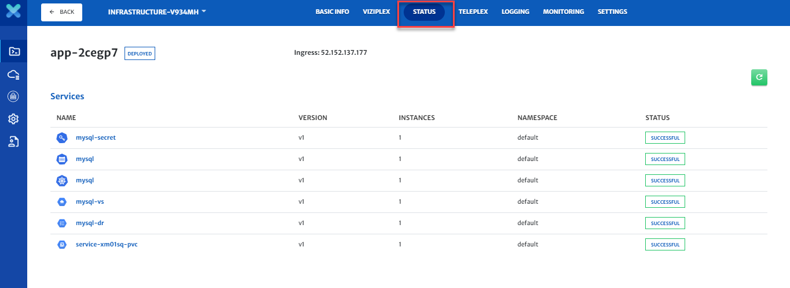

7. To avoid unnecessary costs, don’t forget to terminate your **Application** and then **Infrastructure** when you are done.

8. Click on the **ViziPlex** tab and then on the terminate button to delete all your resources from your infrastructure.

   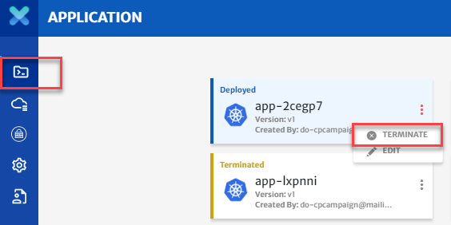

9. Do not forget to terminate your infrastructure as well when you are done with it.

   

**Conclusion:**

You just deployed a MySQL server using dynamic parameters using CloudPlex, the Kubernetes Application Platform for Developers.