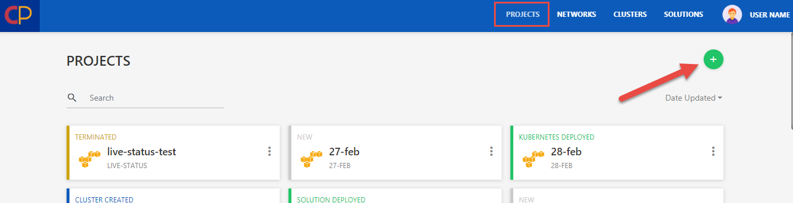
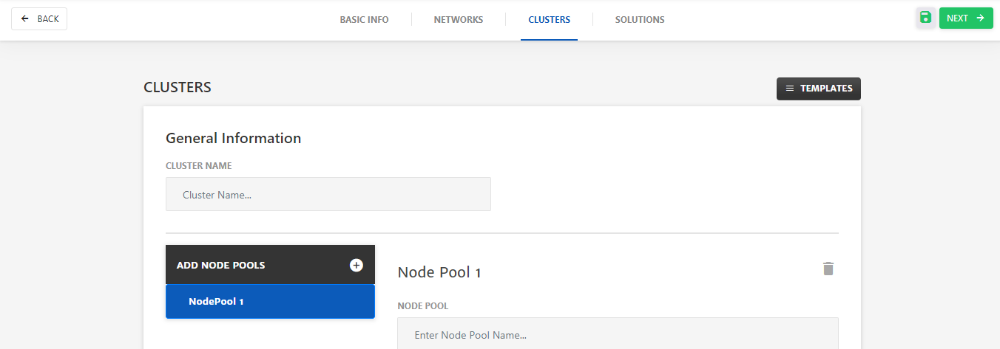

# Product Overview

CloudPlex have developed a platform specially for the cloud native applications called **Mega Mesh**. Mega Mesh as the name suggests is a platform using which mesh can be created of different types of applications and deployment can be performed. 

It will specifically deal with docker or containerized infrastructures. Mega Mesh also supports service mesh to effectively connect, manage and secure microservices. In addition to this, it also supports function as a service or serverless. 

## What is CloudPlex

CloudPlex is basically a cloud management and orchestration platform from where you can effectively manage complex cloud environments and even mix and match public and private clouds to meet your business needs. It helps developers easily build, deploy and manage cloud-native applications with microservices and serverless and that too using a single unified view. 

## Components/Features

Mega Mesh is full of advanced features, some of the major ones are listed below.

### Tools Integration

Mega Mesh has integrated multiple cloud native tools with the platform. Instead of manually downloading and configuring each tool separately, user can setup up the whole thing in Mega Mesh in one go and get everything up and running in under **30 minutes**. Some of the major cloud native tools integrated with Mega Mesh are - Docker, Kubernetes, Istio, Knative, Grafana, Prometheus, Kiali.

### Unified User Interface

Mega Mesh is basically a deployment platform using which you can manage, develop and deploy cloud native applications. It usually takes weeks or even months to understand and use different cloud native tools. 

Using Mega Mesh Unified UI, you can not only manage and configure different cloud native technologies like Istio, Knative etc at one place but also develop and deploy applications as well. Instead of learning all the complex cloud native tools user can just setup an account on Mega Mesh and leave the rest to us. 

Keeping in mind automation and future support as well, Mega Mesh also provides API support as well for all the features available in platform.

### Service Mesh

**Working on it and below...........**

In Mega Mesh, you can deploy a project (deployment step where clusters, networks and applications deployment is configured) and manage complex use cases related to mesh, container or serverless using an easy to use drag and drop UI. 

In Mega Mesh, deployment takes place at Project level and it is divided in to these steps:

1. Configure Basic Info
2. Configure Cluster
3. Configure Network
4. Configure Solutions (docker, mesh, serverless)
5. Deploy

Now lets move to guide on how to deploy a project in Cloud Native. 

## Project

Project is level where everything will be configured and the deployment will take place. Below is the step by step guide on how to create a project.

1. Login to the platform, go to the **Projects** menu from top bar and click "**+**" button to create a new project.

   

2. Configure **Basic Info** of **Project**.

   * Enter **Project Name** and **Project ID**.
   * Enter **Description**.
   * Select the **Cloud Provider** and specify necessary account details for the account.
   * Select **Region** as per requirements.

   

3. Click **Next**.

4. Configure **Networks**.

   * Enter **Network Name**.

   * Select **Virtual Private Cloud** from dropdown i.e. **New** or some existing network. (existing networks will be listed based on account details provided while configuring **Basic Info** tab)
     Network type is whether you want to create any new network or use any existing network VPC or Subnet.
     For **New Network** **Type**:
     * Enter **VPC Name**. 
     * Specify **VPC CIDR**.
     * To add Subnet, go to the **Subnets** tab, click "+" icon and specify the **Subnet Name** and **CIDR**.
     * To add Security Group (SG), go to the **Security Groups** tab. (You can add more than one SG as well)
       * Specify the **SG Name** and **Description**.
       * To add rules for inbound traffic click **Add Inbound Rules** and configure the rule. (You can add more than one rule as well)
         * Select the rule **Type** from dropdown e.g. Custom TCP, Custom UDP etc.
         * Specify the rule **Protocol** i.e. TCP, UDP etc. 
         * Specify the **Ports** that will be exposed to traffic. 
         * Specify **Source**. e.g. 0.0.0.0/0. 
           The Source can be an IPv4 addresses or range of IPv4 addresses in CIDR notation.
       * To add rules for outgoing traffic, click **Add Outbound Rules**. (You can add more than one rule as well)
         * Select the rule **Type** from dropdown e.g. Custom TCP, Custom UDP etc.
         * Specify the rule **Protocol** i.e. TCP, UDP etc. 
         * Specify the **Ports** that will be exposed to traffic. 
         * Specify **Source**. e.g. 0.0.0.0/0. 
           The Source can be an IPv4 addresses or range of IPv4 addresses in CIDR notation.

   

   ​	For **Existing Virtual Private Cloud**:

   ​		Select existing **VPC**,  **Subnet** and **Security Group** from dropdown.

   **Note**: To use any existing network template, click the black **Templates** button to get the list of 	templates. 

5. Click **Next**. (Click the green floppy icon to save the network template)

6. Configure **Clusters**.

   * Enter **Cluster Name** and click **Add Node Pools** button.

   

   * Enter **Node Pool Name**.
   * Specify **Node Count** and **Machine Type** from the dropdown.
   * Select **Subnet** and **Security Groups** from dropdown. (You can select upto 5 subnets for AWS and 1 for Azure.)
   * Select **Key Type** from dropdown i.e. **New** or **Existing**.
     Whether you want to create a new Key or use any existing one.
   * Specify the **AMI ID** and **AMI Username**. (you can get these from cloud admin portal)

7. Click **Next**. (Click the green floppy icon to save the Cluster template)